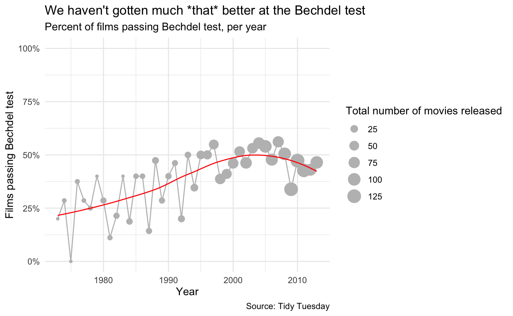
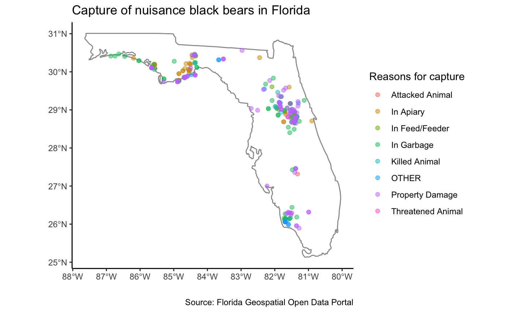
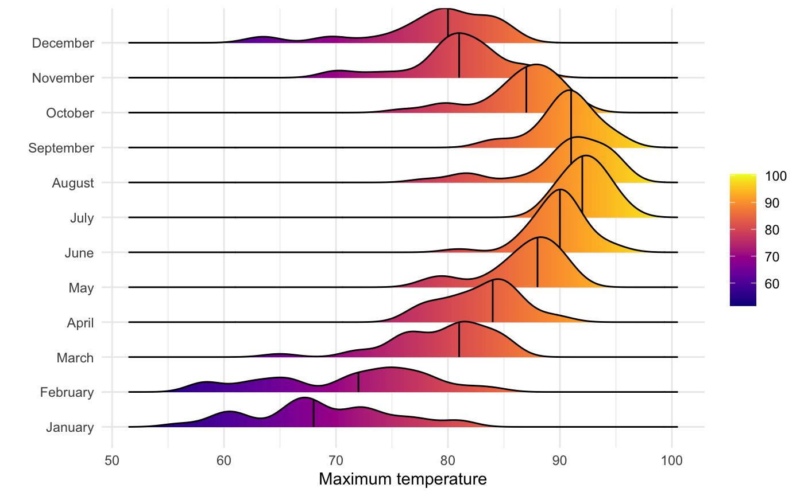

# Data Visualization and Reproducible Research

> Isabel Zimmerman. 

Learn more about me in my [GitHub profile page](https://github.com/isabelizimm)

The following is a sample of products created during the _"Data Visualization and Reproducible Research"_ course.

## Project 01

The [Bechdel Test](https://en.wikipedia.org/wiki/Bechdel_test) is a famous test for content to see if there are at least two characters who are women, that talk to each other, and the conversation is on a topic other a male character. This project explores more about the Bechdel test through a dataset offered by [Tidy Tuesday](https://github.com/rfordatascience/tidytuesday/tree/master/data/2021/2021-03-09).

**Sample data visualization:** 

## Project 02

This project was made to discover interactive plots, spatial visualizations, and model visualizations. I chose to use [Florida black bear capture locations](https://geodata.floridagio.gov/datasets/myfwc::fl-black-bear-capture-locations/explore?location=28.241059%2C-83.859859%2C7.61) offered by the [Florida Geospatial Open Data Portal](https://geodata.floridagio.gov/). The focus of this analysis was looking at the age and capture reason of nuisance black bears.

**Sample data visualization:** 

## Project 03

In this project, I practiced remaking graphics! More than anything, this forced me to think about each element in ggplot individually, and how they work together.

**Sample data visualization:** 

### Moving Forward

I certainly have so much more appreciation for the art of making visualizations. It is so hard to get a message across clearly! The grammar of graphics offers a great way to be able to make graphs quickly and effectively. This course has me really interested in generative art, since I now am realizing how crazy it is that it is even possible to create.
