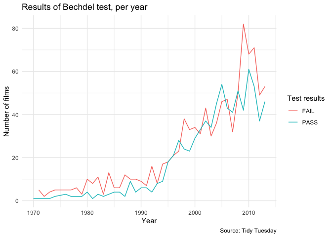
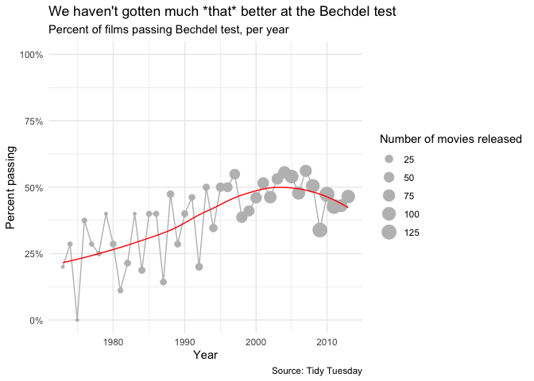
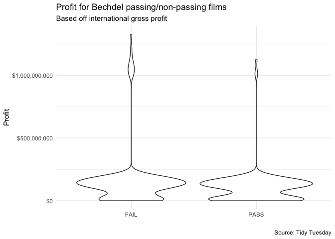
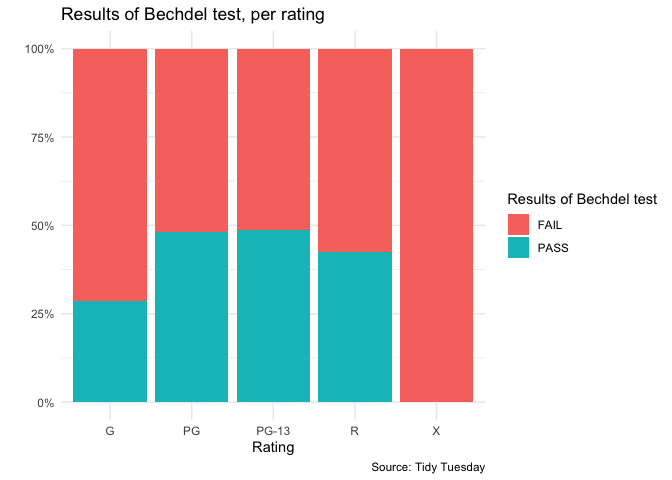

The [Bechdel Test](https://en.wikipedia.org/wiki/Bechdel_test) is a famous test for content to see if there are at least two characters who are women, that talk to each other, and the conversation is on a topic other a male character. While the bar for this criteria truly seems to be on the floor, a vast amount of movies still do not pass the test. Let's discover more with a dataset offered by [Tidy Tuesday](https://github.com/rfordatascience/tidytuesday/tree/master/data/2021/2021-03-09).


```r
library(tidyverse)
```


```r
raw <- read_csv("https://raw.githubusercontent.com/rfordatascience/tidytuesday/master/data/2021/2021-03-09/movies.csv")
```

## Are we better at writing movies that pass the Bechdel test now?


```r
raw %>% 
  select(year, binary) %>% 
  count(year, binary) %>%
  ggplot(mapping = aes(x = year, y = n, color = binary)) +
  geom_line() +
  theme_minimal() +
  labs(x = "Year", y = "Number of films",
       color = "Test results",
       title = "Results of Bechdel test, per year",
       caption = "Source: Tidy Tuesday")
```

<!-- -->
This visualization seeks to show if modern movies are passing the Bechdel test more than in the past. Realistically, the biggest takeaway I get here is that there are a lot more movies in this dataset after the year 2000. It is hard to intuitively understand the relationship between passing and failing movies. Instead, let's translate these into percentages per year of passing/failing.


```r
total_movies_year <- raw %>%
  select(year) %>% 
  count(year) %>% 
  rename(total_movies=n)

pass_per_year <- raw %>%
  select(binary, year) %>% 
  filter(binary == "PASS") %>% 
  group_by(year, binary) %>% 
  count(binary) %>% 
  rename(total_pass=n)

by_year <- left_join(total_movies_year, pass_per_year) 
```


```r
by_year %>% 
  select(-binary) %>% 
  replace(is.na(.), 0) %>% 
  filter(year > 1972) %>% 
  mutate(percent_passing = total_pass / total_movies) %>% 
  ggplot(mapping = aes(x = year, y = percent_passing)) +
  geom_point(mapping = aes(size = total_movies), color = "grey") + 
  geom_line(color = "grey") +
  geom_smooth(method = "loess",
              se = FALSE,
              size = 0.5,
              color = "red") +
  scale_x_log10() +
  theme_minimal() +
  coord_cartesian(ylim = c(0,1)) +
  scale_y_continuous(labels = scales::percent) +
  labs(x = "Year", y = "Percent passing",
       title = "We haven't gotten much *that* better at the Bechdel test",
       subtitle = "Percent of films passing Bechdel test, per year",
       size = "Number of movies released",
       caption = "Source: Tidy Tuesday")
```

<!-- -->

This plot gives a clearer idea of how films have done on the Bechdel test across the years. The size of the dots signifies that there are more movies being released now than decades ago. I chose to make the data points grey and line of best fit red for high contrast. I added labels to all axes, to give users context for each data point. I also removed the year 1970, which only had 1 movie recorded. Finally, the autofit plot zoomed in on the data points, making it fill the space. However, I explicitly set the y-axis from 0 to 1, to better contextualize the fact that generally less than 50% of the films were passing.

## Is a Bechdel-passing test movie a good business decision?


```r
raw %>% 
  select(intgross, binary, year) %>%
  filter(year >= 2000, intgross < 1000000000) %>% 
  drop_na() %>% 
  ggplot(mapping = aes(y = as.numeric(intgross), factor(binary))) +
  geom_violin() +
  scale_y_continuous(labels = scales::dollar) +
  theme_minimal() +
  labs(x = " ", title = "Profit for Bechdel passing/non-passing films",
       subtitle = "Based off international gross profit",
       y = "Profit",
       size = "Total number of movies released",
       caption = "Source: Tidy Tuesday")
```

<!-- -->

This plot seeks to see if movies that pass the Bechdel test make more profit (in a very binary view of what "good business decision" means). We can see here that the majority of movies, that make less than $250,000,000, have similar profit structures, regardless of test results. However, more high-profit films fail the Bechdel test. You could extend this story by breaking up high-profit and low-profit films, and see the distribution. I chose violin plots, since they give users a clearer picture of multi-modal distributions than box plots, as seen above.


# What kinds of movies are failing? 


```r
movie_ratings <- c("G", "PG", "PG-13", "R", "X")
raw %>% 
  select(binary, rated) %>%
  filter(rated == movie_ratings) %>% 
  ggplot(mapping = aes(x=rated)) +
  scale_y_continuous(labels = scales::percent) +
  geom_bar(mapping = aes(fill = binary), stat="count", position = "fill") +
  theme_minimal() +  
  labs(x = "Rating", y = " ",
       fill = "Results of Bechdel test",
       title = "Results of Bechdel test, per rating",
       caption = "Source: Tidy Tuesday")
```

<!-- -->

This graphic was made specifically to be able to quickly compare passing rates for different film ratings[^1]. By using `position = fill` argument, all of the ratings are standardized so each bar has the same height. This lowers the cognitive load of users comparing across ratings. The storyline of "what films do the worst on tests?" could be extended by looking at genre, language, or even nominations for awards.

[^1]: A quick shout-out to the dismal pass rates of G-rated movies, which was even more shocking than the 0% pass rate of X-rated films.


# Conclusion

A quick scroll through the code in this notebook shows that most of the effort is in aesthetics. When it comes to visualization, much of the creative process is dedicated to adjusting the "look" to lower the cognitive load of those interpreting the graphs. I also specifically wanted to make sure every plot had labels on each axes, labeled keys (if applicable), a source, a title, and a subtitle. This is a small addition, but elevates the look and comprehension of each graph. Care was also taken to make sure each axis was displayed in the scale that users would expect-- percentages are labeled with percent symbols, rather than having ambiguous decimals. It was also important to me to keep each visualization as simple as possible. It is fun to add layers, colors, facets, etc, but often this takes away from plots more than it adds. In all, I found I am a visualization minimalist in this first mini-project.
