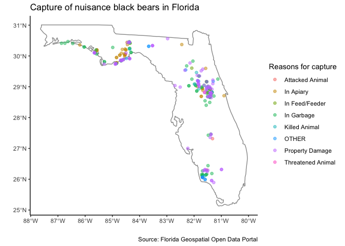
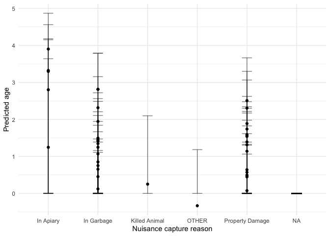
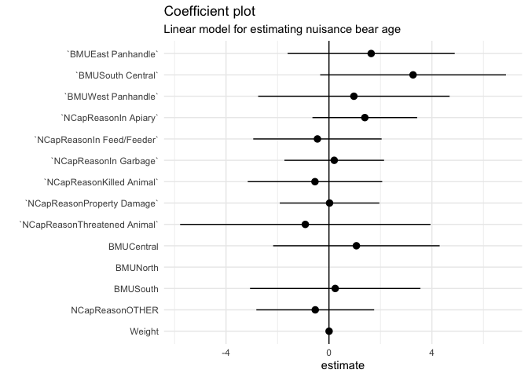

# Nuisance captures of black bears in Florida

While Florida may be well known for the rambunctious activities of alligators, I chose to better understand the types of bears being captured for nuisance reasons. Nuisance bears are not injured or captured for research. They are simply running around and causing trouble, as bears sometimes do. There could be a great story from this data: an exploration of different bears, highlighting a juvenile bear being relocated from rummaging through trash, or looking into what kind of bears are recaptures. I really love that this data included the whole "bear capture timeline" from capture date, capture method, and capture reason, to its final action, whether that be rehab, release, or other.  


```r
raw <- read_sf("../data/blackbears/FL_Black_Bear_Capture_Locations.shp")
raw
```

```
## Simple feature collection with 1825 features and 33 fields (with 2 geometries empty)
## Geometry type: POINT
## Dimension:     XY
## Bounding box:  xmin: -87.4664 ymin: 25.57503 xmax: -80.25332 ymax: 30.98165
## Geodetic CRS:  WGS 84
## # A tibble: 1,825 × 34
##    OBJECTID IncidentID    ReportDate CapDate    Region BMU   County Locale City 
##       <int> <chr>         <date>     <date>     <chr>  <chr> <chr>  <chr>  <chr>
##  1     8757 Bear-0000016… 1900-01-01 2014-07-25 North… Cent… Putnam <NA>   <NA> 
##  2     8758 Bear-0000016… 1900-01-01 2013-07-25 North… Cent… Putnam <NA>   <NA> 
##  3     8759 Bear-0000009… 1981-10-15 1981-10-15 North… Cent… Semin… <NA>   SANF…
##  4     8760 Bear-0000014… 1982-05-28 NA         North… Cent… Lake   OTHER  OCAL…
##  5     8761 Bear-0000014… 1985-01-01 NA         North… West… Okalo… OTHER  <NA> 
##  6     8762 Bear-0000006… 1986-05-13 1986-05-14 North… North Baker  OTHER  SEBR…
##  7     8763 Bear-0000014… 1986-06-10 NA         North… West… Okalo… OTHER  <NA> 
##  8     8764 Bear-0000009… 1986-08-02 1986-08-02 North… Cent… Clay   OTHER  MIDD…
##  9     8765 Bear-0000009… 1986-09-10 1986-09-10 North… North Baker  OTHER  GLEN…
## 10     8766 Bear-0000014… 1987-07-30 1987-07-30 South  South Colli… <NA>   <NA> 
## # … with 1,815 more rows, and 25 more variables: ZipCode <chr>, Latitude <dbl>,
## #   Longitude <dbl>, CapReason <chr>, OCapReason <chr>, NCapReason <chr>,
## #   CapMethod <chr>, OrigCap <chr>, FinAction <chr>, OFinAction <chr>,
## #   Sex <chr>, AgeClass <chr>, Weight <dbl>, Age <dbl>, Cubs <chr>,
## #   Yearlings <chr>, LEarTag1 <chr>, LEarTag2 <chr>, REarTag1 <chr>,
## #   REarTag2 <chr>, Tattoo1 <chr>, Tattoo2 <chr>, TrackNum <chr>,
## #   last_edite <date>, geometry <POINT [°]>
```


```r
fl <- map_data("state", "florida")

ncap <- raw %>% 
  drop_na(NCapReason)
```


```r
nbears_plot <- ggplot() +
  geom_polygon(fl, mapping = aes(long, lat), fill = NA, colour = "grey60") +
  geom_sf(st_as_sf(ncap), mapping = aes(color = NCapReason), size = 1.7, alpha = 0.5) +
  theme_classic() +
  labs(
    x = "",
    y = "",
    title = "Capture of nuisance black bears in Florida",
    caption = "Source: Florida Geospatial Open Data Portal",
    color = "Reasons for capture")
nbears_plot
```

<!-- -->
The shapefile gave us GIS data to locate where each bear was being captured, with colors to highlight the kind of capture occurring. I chose to show only the outline of Florida for the cleanest possible look. However, another iteration may include a light outline of counties to help contextualize capture location, while not getting in the way of readability. I find this visualization sparks me no joy, so I decided to reuse many core elements, make it interactive, and give more context to liven it up a little.


```r
nbears_more_info <- ggplot() +
  geom_polygon(fl, mapping = aes(long, lat), fill = NA, colour = "grey60") +
  geom_sf(st_as_sf(ncap), mapping = aes(color = NCapReason, text = paste("Method:", CapMethod, "\nAge:", AgeClass)), size = 1.7, alpha = 0.5) +
  theme_classic() +
  labs(
    x = "",
    y = "",
    title = "Capture of nuisance black bears in Florida",
    color = "Reasons for capture")

interact <- ggplotly(nbears_more_info)
interact
```

```{=html}
<div id="htmlwidget-2016eeec944e4795058d" style="width:672px;height:480px;" class="plotly html-widget"></div>
<script type="application/json" data-for="htmlwidget-2016eeec944e4795058d">{"x":{"data":[{"x":[-88,-88,-88,-88,-88,-88,-88,-88,-88,-88,-88,-88,-88,-88,-88,-88,-88,-88,-88,-88,-88,-88,-88,-88,-88,-88,-88,-88,-88,-88,-88,-88,-88,-88,-88,-88,-88,-88,-88,-88,-88,-88,-88,-88,-88,-88,-88,-88,-88,-88,-88,-88,-88,-88,-88,-88,-88,-88,-88,-88,-88,-88,-88,-88,-88,-88,-88,-88,-88,-88,-88,-88,-88,-88,-88,-88,-88,-88,-88,-88,-88,-88,null,-87,-87,-87,-87,-87,-87,-87,-87,-87,-87,-87,-87,-87,-87,-87,-87,-87,-87,-87,-87,-87,-87,-87,-87,-87,-87,-87,-87,-87,-87,-87,-87,-87,-87,-87,-87,-87,-87,-87,-87,-87,-87,-87,-87,-87,-87,-87,-87,-87,-87,-87,-87,-87,-87,-87,-87,-87,-87,-87,-87,-87,-87,-87,-87,-87,-87,-87,-87,-87,-87,-87,-87,-87,-87,-87,-87,-87,-87,-87,-87,-87,-87,null,-86,-86,-86,-86,-86,-86,-86,-86,-86,-86,-86,-86,-86,-86,-86,-86,-86,-86,-86,-86,-86,-86,-86,-86,-86,-86,-86,-86,-86,-86,-86,-86,-86,-86,-86,-86,-86,-86,-86,-86,-86,-86,-86,-86,-86,-86,-86,-86,-86,-86,-86,-86,-86,-86,-86,-86,-86,-86,-86,-86,-86,-86,-86,-86,-86,-86,-86,-86,-86,-86,-86,-86,-86,-86,-86,-86,-86,-86,-86,-86,-86,-86,null,-85,-85,-85,-85,-85,-85,-85,-85,-85,-85,-85,-85,-85,-85,-85,-85,-85,-85,-85,-85,-85,-85,-85,-85,-85,-85,-85,-85,-85,-85,-85,-85,-85,-85,-85,-85,-85,-85,-85,-85,-85,-85,-85,-85,-85,-85,-85,-85,-85,-85,-85,-85,-85,-85,-85,-85,-85,-85,-85,-85,-85,-85,-85,-85,-85,-85,-85,-85,-85,-85,-85,-85,-85,-85,-85,-85,-85,-85,-85,-85,-85,-85,null,-84,-84,-84,-84,-84,-84,-84,-84,-84,-84,-84,-84,-84,-84,-84,-84,-84,-84,-84,-84,-84,-84,-84,-84,-84,-84,-84,-84,-84,-84,-84,-84,-84,-84,-84,-84,-84,-84,-84,-84,-84,-84,-84,-84,-84,-84,-84,-84,-84,-84,-84,-84,-84,-84,-84,-84,-84,-84,-84,-84,-84,-84,-84,-84,-84,-84,-84,-84,-84,-84,-84,-84,-84,-84,-84,-84,-84,-84,-84,-84,-84,-84,null,-83,-83,-83,-83,-83,-83,-83,-83,-83,-83,-83,-83,-83,-83,-83,-83,-83,-83,-83,-83,-83,-83,-83,-83,-83,-83,-83,-83,-83,-83,-83,-83,-83,-83,-83,-83,-83,-83,-83,-83,-83,-83,-83,-83,-83,-83,-83,-83,-83,-83,-83,-83,-83,-83,-83,-83,-83,-83,-83,-83,-83,-83,-83,-83,-83,-83,-83,-83,-83,-83,-83,-83,-83,-83,-83,-83,-83,-83,-83,-83,-83,-83,null,-82,-82,-82,-82,-82,-82,-82,-82,-82,-82,-82,-82,-82,-82,-82,-82,-82,-82,-82,-82,-82,-82,-82,-82,-82,-82,-82,-82,-82,-82,-82,-82,-82,-82,-82,-82,-82,-82,-82,-82,-82,-82,-82,-82,-82,-82,-82,-82,-82,-82,-82,-82,-82,-82,-82,-82,-82,-82,-82,-82,-82,-82,-82,-82,-82,-82,-82,-82,-82,-82,-82,-82,-82,-82,-82,-82,-82,-82,-82,-82,-82,-82,null,-81,-81,-81,-81,-81,-81,-81,-81,-81,-81,-81,-81,-81,-81,-81,-81,-81,-81,-81,-81,-81,-81,-81,-81,-81,-81,-81,-81,-81,-81,-81,-81,-81,-81,-81,-81,-81,-81,-81,-81,-81,-81,-81,-81,-81,-81,-81,-81,-81,-81,-81,-81,-81,-81,-81,-81,-81,-81,-81,-81,-81,-81,-81,-81,-81,-81,-81,-81,-81,-81,-81,-81,-81,-81,-81,-81,-81,-81,-81,-81,-81,-81,null,-80,-80,-80,-80,-80,-80,-80,-80,-80,-80,-80,-80,-80,-80,-80,-80,-80,-80,-80,-80,-80,-80,-80,-80,-80,-80,-80,-80,-80,-80,-80,-80,-80,-80,-80,-80,-80,-80,-80,-80,-80,-80,-80,-80,-80,-80,-80,-80,-80,-80,-80,-80,-80,-80,-80,-80,-80,-80,-80,-80,-80,-80,-80,-80,-80,-80,-80,-80,-80,-80,-80,-80,-80,-80,-80,-80,-80,-80,-80,-80,-80,-80,null,-88.0194969177246,-87.989898989899,-87.8888888888889,-87.7878787878788,-87.6868686868687,-87.5858585858586,-87.4848484848485,-87.3838383838384,-87.2828282828283,-87.1818181818182,-87.0808080808081,-86.979797979798,-86.8787878787879,-86.7777777777778,-86.6767676767677,-86.5757575757576,-86.4747474747475,-86.3737373737374,-86.2727272727273,-86.1717171717172,-86.0707070707071,-85.969696969697,-85.8686868686869,-85.7676767676768,-85.6666666666667,-85.5656565656566,-85.4646464646465,-85.3636363636364,-85.2626262626263,-85.1616161616162,-85.0606060606061,-84.959595959596,-84.8585858585859,-84.7575757575758,-84.6565656565657,-84.5555555555556,-84.4545454545455,-84.3535353535353,-84.2525252525253,-84.1515151515152,-84.0505050505051,-83.9494949494949,-83.8484848484848,-83.7474747474747,-83.6464646464647,-83.5454545454545,-83.4444444444444,-83.3434343434343,-83.2424242424242,-83.1414141414142,-83.040404040404,-82.9393939393939,-82.8383838383838,-82.7373737373737,-82.6363636363636,-82.5353535353535,-82.4343434343434,-82.3333333333333,-82.2323232323232,-82.1313131313131,-82.030303030303,-81.9292929292929,-81.8282828282828,-81.7272727272727,-81.6262626262626,-81.5252525252525,-81.4242424242424,-81.3232323232323,-81.2222222222222,-81.1212121212121,-81.020202020202,-80.9191919191919,-80.8181818181818,-80.7171717171717,-80.6161616161616,-80.5151515151515,-80.4141414141414,-80.3131313131313,-80.2121212121212,-80.1111111111111,-80.010101010101,-79.9090909090909,-79.8080808080808,-79.7070707070707,-79.6623268127441,null,-88.0194969177246,-87.989898989899,-87.8888888888889,-87.7878787878788,-87.6868686868687,-87.5858585858586,-87.4848484848485,-87.3838383838384,-87.2828282828283,-87.1818181818182,-87.0808080808081,-86.979797979798,-86.8787878787879,-86.7777777777778,-86.6767676767677,-86.5757575757576,-86.4747474747475,-86.3737373737374,-86.2727272727273,-86.1717171717172,-86.0707070707071,-85.969696969697,-85.8686868686869,-85.7676767676768,-85.6666666666667,-85.5656565656566,-85.4646464646465,-85.3636363636364,-85.2626262626263,-85.1616161616162,-85.0606060606061,-84.959595959596,-84.8585858585859,-84.7575757575758,-84.6565656565657,-84.5555555555556,-84.4545454545455,-84.3535353535353,-84.2525252525253,-84.1515151515152,-84.0505050505051,-83.9494949494949,-83.8484848484848,-83.7474747474747,-83.6464646464647,-83.5454545454545,-83.4444444444444,-83.3434343434343,-83.2424242424242,-83.1414141414142,-83.040404040404,-82.9393939393939,-82.8383838383838,-82.7373737373737,-82.6363636363636,-82.5353535353535,-82.4343434343434,-82.3333333333333,-82.2323232323232,-82.1313131313131,-82.030303030303,-81.9292929292929,-81.8282828282828,-81.7272727272727,-81.6262626262626,-81.5252525252525,-81.4242424242424,-81.3232323232323,-81.2222222222222,-81.1212121212121,-81.020202020202,-80.9191919191919,-80.8181818181818,-80.7171717171717,-80.6161616161616,-80.5151515151515,-80.4141414141414,-80.3131313131313,-80.2121212121212,-80.1111111111111,-80.010101010101,-79.9090909090909,-79.8080808080808,-79.7070707070707,-79.6623268127441,null,-88.0194969177246,-87.989898989899,-87.8888888888889,-87.7878787878788,-87.6868686868687,-87.5858585858586,-87.4848484848485,-87.3838383838384,-87.2828282828283,-87.1818181818182,-87.0808080808081,-86.979797979798,-86.8787878787879,-86.7777777777778,-86.6767676767677,-86.5757575757576,-86.4747474747475,-86.3737373737374,-86.2727272727273,-86.1717171717172,-86.0707070707071,-85.969696969697,-85.8686868686869,-85.7676767676768,-85.6666666666667,-85.5656565656566,-85.4646464646465,-85.3636363636364,-85.2626262626263,-85.1616161616162,-85.0606060606061,-84.959595959596,-84.8585858585859,-84.7575757575758,-84.6565656565657,-84.5555555555556,-84.4545454545455,-84.3535353535353,-84.2525252525253,-84.1515151515152,-84.0505050505051,-83.9494949494949,-83.8484848484848,-83.7474747474747,-83.6464646464647,-83.5454545454545,-83.4444444444444,-83.3434343434343,-83.2424242424242,-83.1414141414142,-83.040404040404,-82.9393939393939,-82.8383838383838,-82.7373737373737,-82.6363636363636,-82.5353535353535,-82.4343434343434,-82.3333333333333,-82.2323232323232,-82.1313131313131,-82.030303030303,-81.9292929292929,-81.8282828282828,-81.7272727272727,-81.6262626262626,-81.5252525252525,-81.4242424242424,-81.3232323232323,-81.2222222222222,-81.1212121212121,-81.020202020202,-80.9191919191919,-80.8181818181818,-80.7171717171717,-80.6161616161616,-80.5151515151515,-80.4141414141414,-80.3131313131313,-80.2121212121212,-80.1111111111111,-80.010101010101,-79.9090909090909,-79.8080808080808,-79.7070707070707,-79.6623268127441,null,-88.0194969177246,-87.989898989899,-87.8888888888889,-87.7878787878788,-87.6868686868687,-87.5858585858586,-87.4848484848485,-87.3838383838384,-87.2828282828283,-87.1818181818182,-87.0808080808081,-86.979797979798,-86.8787878787879,-86.7777777777778,-86.6767676767677,-86.5757575757576,-86.4747474747475,-86.3737373737374,-86.2727272727273,-86.1717171717172,-86.0707070707071,-85.969696969697,-85.8686868686869,-85.7676767676768,-85.6666666666667,-85.5656565656566,-85.4646464646465,-85.3636363636364,-85.2626262626263,-85.1616161616162,-85.0606060606061,-84.959595959596,-84.8585858585859,-84.7575757575758,-84.6565656565657,-84.5555555555556,-84.4545454545455,-84.3535353535353,-84.2525252525253,-84.1515151515152,-84.0505050505051,-83.9494949494949,-83.8484848484848,-83.7474747474747,-83.6464646464647,-83.5454545454545,-83.4444444444444,-83.3434343434343,-83.2424242424242,-83.1414141414142,-83.040404040404,-82.9393939393939,-82.8383838383838,-82.7373737373737,-82.6363636363636,-82.5353535353535,-82.4343434343434,-82.3333333333333,-82.2323232323232,-82.1313131313131,-82.030303030303,-81.9292929292929,-81.8282828282828,-81.7272727272727,-81.6262626262626,-81.5252525252525,-81.4242424242424,-81.3232323232323,-81.2222222222222,-81.1212121212121,-81.020202020202,-80.9191919191919,-80.8181818181818,-80.7171717171717,-80.6161616161616,-80.5151515151515,-80.4141414141414,-80.3131313131313,-80.2121212121212,-80.1111111111111,-80.010101010101,-79.9090909090909,-79.8080808080808,-79.7070707070707,-79.6623268127441,null,-88.0194969177246,-87.989898989899,-87.8888888888889,-87.7878787878788,-87.6868686868687,-87.5858585858586,-87.4848484848485,-87.3838383838384,-87.2828282828283,-87.1818181818182,-87.0808080808081,-86.979797979798,-86.8787878787879,-86.7777777777778,-86.6767676767677,-86.5757575757576,-86.4747474747475,-86.3737373737374,-86.2727272727273,-86.1717171717172,-86.0707070707071,-85.969696969697,-85.8686868686869,-85.7676767676768,-85.6666666666667,-85.5656565656566,-85.4646464646465,-85.3636363636364,-85.2626262626263,-85.1616161616162,-85.0606060606061,-84.959595959596,-84.8585858585859,-84.7575757575758,-84.6565656565657,-84.5555555555556,-84.4545454545455,-84.3535353535353,-84.2525252525253,-84.1515151515152,-84.0505050505051,-83.9494949494949,-83.8484848484848,-83.7474747474747,-83.6464646464647,-83.5454545454545,-83.4444444444444,-83.3434343434343,-83.2424242424242,-83.1414141414142,-83.040404040404,-82.9393939393939,-82.8383838383838,-82.7373737373737,-82.6363636363636,-82.5353535353535,-82.4343434343434,-82.3333333333333,-82.2323232323232,-82.1313131313131,-82.030303030303,-81.9292929292929,-81.8282828282828,-81.7272727272727,-81.6262626262626,-81.5252525252525,-81.4242424242424,-81.3232323232323,-81.2222222222222,-81.1212121212121,-81.020202020202,-80.9191919191919,-80.8181818181818,-80.7171717171717,-80.6161616161616,-80.5151515151515,-80.4141414141414,-80.3131313131313,-80.2121212121212,-80.1111111111111,-80.010101010101,-79.9090909090909,-79.8080808080808,-79.7070707070707,-79.6623268127441,null,-88.0194969177246,-87.989898989899,-87.8888888888889,-87.7878787878788,-87.6868686868687,-87.5858585858586,-87.4848484848485,-87.3838383838384,-87.2828282828283,-87.1818181818182,-87.0808080808081,-86.979797979798,-86.8787878787879,-86.7777777777778,-86.6767676767677,-86.5757575757576,-86.4747474747475,-86.3737373737374,-86.2727272727273,-86.1717171717172,-86.0707070707071,-85.969696969697,-85.8686868686869,-85.7676767676768,-85.6666666666667,-85.5656565656566,-85.4646464646465,-85.3636363636364,-85.2626262626263,-85.1616161616162,-85.0606060606061,-84.959595959596,-84.8585858585859,-84.7575757575758,-84.6565656565657,-84.5555555555556,-84.4545454545455,-84.3535353535353,-84.2525252525253,-84.1515151515152,-84.0505050505051,-83.9494949494949,-83.8484848484848,-83.7474747474747,-83.6464646464647,-83.5454545454545,-83.4444444444444,-83.3434343434343,-83.2424242424242,-83.1414141414142,-83.040404040404,-82.9393939393939,-82.8383838383838,-82.7373737373737,-82.6363636363636,-82.5353535353535,-82.4343434343434,-82.3333333333333,-82.2323232323232,-82.1313131313131,-82.030303030303,-81.9292929292929,-81.8282828282828,-81.7272727272727,-81.6262626262626,-81.5252525252525,-81.4242424242424,-81.3232323232323,-81.2222222222222,-81.1212121212121,-81.020202020202,-80.9191919191919,-80.8181818181818,-80.7171717171717,-80.6161616161616,-80.5151515151515,-80.4141414141414,-80.3131313131313,-80.2121212121212,-80.1111111111111,-80.010101010101,-79.9090909090909,-79.8080808080808,-79.7070707070707,-79.6623268127441,null,-88.0194969177246,-87.989898989899,-87.8888888888889,-87.7878787878788,-87.6868686868687,-87.5858585858586,-87.4848484848485,-87.3838383838384,-87.2828282828283,-87.1818181818182,-87.0808080808081,-86.979797979798,-86.8787878787879,-86.7777777777778,-86.6767676767677,-86.5757575757576,-86.4747474747475,-86.3737373737374,-86.2727272727273,-86.1717171717172,-86.0707070707071,-85.969696969697,-85.8686868686869,-85.7676767676768,-85.6666666666667,-85.5656565656566,-85.4646464646465,-85.3636363636364,-85.2626262626263,-85.1616161616162,-85.0606060606061,-84.959595959596,-84.8585858585859,-84.7575757575758,-84.6565656565657,-84.5555555555556,-84.4545454545455,-84.3535353535353,-84.2525252525253,-84.1515151515152,-84.0505050505051,-83.9494949494949,-83.8484848484848,-83.7474747474747,-83.6464646464647,-83.5454545454545,-83.4444444444444,-83.3434343434343,-83.2424242424242,-83.1414141414142,-83.040404040404,-82.9393939393939,-82.8383838383838,-82.7373737373737,-82.6363636363636,-82.5353535353535,-82.4343434343434,-82.3333333333333,-82.2323232323232,-82.1313131313131,-82.030303030303,-81.9292929292929,-81.8282828282828,-81.7272727272727,-81.6262626262626,-81.5252525252525,-81.4242424242424,-81.3232323232323,-81.2222222222222,-81.1212121212121,-81.020202020202,-80.9191919191919,-80.8181818181818,-80.7171717171717,-80.6161616161616,-80.5151515151515,-80.4141414141414,-80.3131313131313,-80.2121212121212,-80.1111111111111,-80.010101010101,-79.9090909090909,-79.8080808080808,-79.7070707070707,-79.6623268127441],"y":[24.8360187259984,24.8888888888889,24.969696969697,25.0505050505051,25.1313131313131,25.2121212121212,25.2929292929293,25.3737373737374,25.4545454545455,25.5353535353535,25.6161616161616,25.6969696969697,25.7777777777778,25.8585858585859,25.9393939393939,26.020202020202,26.1010101010101,26.1818181818182,26.2626262626263,26.3434343434343,26.4242424242424,26.5050505050505,26.5858585858586,26.6666666666667,26.7474747474748,26.8282828282828,26.9090909090909,26.989898989899,27.0707070707071,27.1515151515152,27.2323232323232,27.3131313131313,27.3939393939394,27.4747474747475,27.5555555555556,27.6363636363636,27.7171717171717,27.7979797979798,27.8787878787879,27.959595959596,28.040404040404,28.1212121212121,28.2020202020202,28.2828282828283,28.3636363636364,28.4444444444444,28.5252525252525,28.6060606060606,28.6868686868687,28.7676767676768,28.8484848484848,28.9292929292929,29.010101010101,29.0909090909091,29.1717171717172,29.2525252525252,29.3333333333333,29.4141414141414,29.4949494949495,29.5757575757576,29.6565656565657,29.7373737373737,29.8181818181818,29.8989898989899,29.979797979798,30.0606060606061,30.1414141414141,30.2222222222222,30.3030303030303,30.3838383838384,30.4646464646465,30.5454545454545,30.6262626262626,30.7070707070707,30.7878787878788,30.8686868686869,30.949494949495,31.030303030303,31.1111111111111,31.1919191919192,31.2727272727273,31.3024219318271,null,24.8360699691292,24.8888888888889,24.969696969697,25.0505050505051,25.1313131313131,25.2121212121212,25.2929292929293,25.3737373737374,25.4545454545455,25.5353535353535,25.6161616161616,25.6969696969697,25.7777777777778,25.8585858585859,25.9393939393939,26.020202020202,26.1010101010101,26.1818181818182,26.2626262626263,26.3434343434343,26.4242424242424,26.5050505050505,26.5858585858586,26.6666666666667,26.7474747474748,26.8282828282828,26.9090909090909,26.989898989899,27.0707070707071,27.1515151515152,27.2323232323232,27.3131313131313,27.3939393939394,27.4747474747475,27.5555555555556,27.6363636363636,27.7171717171717,27.7979797979798,27.8787878787879,27.959595959596,28.040404040404,28.1212121212121,28.2020202020202,28.2828282828283,28.3636363636364,28.4444444444444,28.5252525252525,28.6060606060606,28.6868686868687,28.7676767676768,28.8484848484848,28.9292929292929,29.010101010101,29.0909090909091,29.1717171717172,29.2525252525252,29.3333333333333,29.4141414141414,29.4949494949495,29.5757575757576,29.6565656565657,29.7373737373737,29.8181818181818,29.8989898989899,29.979797979798,30.0606060606061,30.1414141414141,30.2222222222222,30.3030303030303,30.3838383838384,30.4646464646465,30.5454545454545,30.6262626262626,30.7070707070707,30.7878787878788,30.8686868686869,30.949494949495,31.030303030303,31.1111111111111,31.1919191919192,31.2727272727273,31.3024816108058,null,24.8360034398307,24.8888888888889,24.969696969697,25.0505050505051,25.1313131313131,25.2121212121212,25.2929292929293,25.3737373737374,25.4545454545455,25.5353535353535,25.6161616161616,25.6969696969697,25.7777777777778,25.8585858585859,25.9393939393939,26.020202020202,26.1010101010101,26.1818181818182,26.2626262626263,26.3434343434343,26.4242424242424,26.5050505050505,26.5858585858586,26.6666666666667,26.7474747474748,26.8282828282828,26.9090909090909,26.989898989899,27.0707070707071,27.1515151515152,27.2323232323232,27.3131313131313,27.3939393939394,27.4747474747475,27.5555555555556,27.6363636363636,27.7171717171717,27.7979797979798,27.8787878787879,27.959595959596,28.040404040404,28.1212121212121,28.2020202020202,28.2828282828283,28.3636363636364,28.4444444444444,28.5252525252525,28.6060606060606,28.6868686868687,28.7676767676768,28.8484848484848,28.9292929292929,29.010101010101,29.0909090909091,29.1717171717172,29.2525252525252,29.3333333333333,29.4141414141414,29.4949494949495,29.5757575757576,29.6565656565657,29.7373737373737,29.8181818181818,29.8989898989899,29.979797979798,30.0606060606061,30.1414141414141,30.2222222222222,30.3030303030303,30.3838383838384,30.4646464646465,30.5454545454545,30.6262626262626,30.7070707070707,30.7878787878788,30.8686868686869,30.949494949495,31.030303030303,31.1111111111111,31.1919191919192,31.2727272727273,31.3024041291846,null,24.8360702271909,24.8888888888889,24.969696969697,25.0505050505051,25.1313131313131,25.2121212121212,25.2929292929293,25.3737373737374,25.4545454545454,25.5353535353535,25.6161616161616,25.6969696969697,25.7777777777778,25.8585858585859,25.9393939393939,26.020202020202,26.1010101010101,26.1818181818182,26.2626262626263,26.3434343434343,26.4242424242424,26.5050505050505,26.5858585858586,26.6666666666667,26.7474747474748,26.8282828282828,26.9090909090909,26.989898989899,27.0707070707071,27.1515151515152,27.2323232323232,27.3131313131313,27.3939393939394,27.4747474747475,27.5555555555556,27.6363636363636,27.7171717171717,27.7979797979798,27.8787878787879,27.959595959596,28.040404040404,28.1212121212121,28.2020202020202,28.2828282828283,28.3636363636364,28.4444444444444,28.5252525252525,28.6060606060606,28.6868686868687,28.7676767676768,28.8484848484848,28.9292929292929,29.010101010101,29.0909090909091,29.1717171717172,29.2525252525252,29.3333333333333,29.4141414141414,29.4949494949495,29.5757575757576,29.6565656565657,29.7373737373737,29.8181818181818,29.8989898989899,29.979797979798,30.0606060606061,30.1414141414141,30.2222222222222,30.3030303030303,30.3838383838384,30.4646464646465,30.5454545454545,30.6262626262626,30.7070707070707,30.7878787878788,30.8686868686869,30.9494949494949,31.030303030303,31.1111111111111,31.1919191919192,31.2727272727273,31.3024819113506,null,24.8360149304354,24.8888888888889,24.969696969697,25.0505050505051,25.1313131313131,25.2121212121212,25.2929292929293,25.3737373737374,25.4545454545455,25.5353535353535,25.6161616161616,25.6969696969697,25.7777777777778,25.8585858585859,25.9393939393939,26.020202020202,26.1010101010101,26.1818181818182,26.2626262626263,26.3434343434343,26.4242424242424,26.5050505050505,26.5858585858586,26.6666666666667,26.7474747474748,26.8282828282828,26.9090909090909,26.989898989899,27.0707070707071,27.1515151515152,27.2323232323232,27.3131313131313,27.3939393939394,27.4747474747475,27.5555555555556,27.6363636363636,27.7171717171717,27.7979797979798,27.8787878787879,27.959595959596,28.040404040404,28.1212121212121,28.2020202020202,28.2828282828283,28.3636363636364,28.4444444444444,28.5252525252525,28.6060606060606,28.6868686868687,28.7676767676768,28.8484848484848,28.9292929292929,29.010101010101,29.0909090909091,29.1717171717172,29.2525252525252,29.3333333333333,29.4141414141414,29.4949494949495,29.5757575757576,29.6565656565657,29.7373737373737,29.8181818181818,29.8989898989899,29.979797979798,30.0606060606061,30.1414141414141,30.2222222222222,30.3030303030303,30.3838383838384,30.4646464646465,30.5454545454545,30.6262626262626,30.7070707070707,30.7878787878788,30.8686868686869,30.949494949495,31.030303030303,31.1111111111111,31.1919191919192,31.2727272727273,31.3024175114224,null,24.8360685061003,24.8888888888889,24.969696969697,25.0505050505051,25.1313131313131,25.2121212121212,25.2929292929293,25.3737373737374,25.4545454545455,25.5353535353535,25.6161616161616,25.6969696969697,25.7777777777778,25.8585858585859,25.9393939393939,26.020202020202,26.1010101010101,26.1818181818182,26.2626262626263,26.3434343434343,26.4242424242424,26.5050505050505,26.5858585858586,26.6666666666667,26.7474747474748,26.8282828282828,26.9090909090909,26.989898989899,27.0707070707071,27.1515151515152,27.2323232323232,27.3131313131313,27.3939393939394,27.4747474747475,27.5555555555556,27.6363636363636,27.7171717171717,27.7979797979798,27.8787878787879,27.959595959596,28.040404040404,28.1212121212121,28.2020202020202,28.2828282828283,28.3636363636364,28.4444444444444,28.5252525252525,28.6060606060606,28.6868686868687,28.7676767676768,28.8484848484848,28.9292929292929,29.010101010101,29.0909090909091,29.1717171717172,29.2525252525252,29.3333333333333,29.4141414141414,29.4949494949495,29.5757575757576,29.6565656565657,29.7373737373737,29.8181818181818,29.8989898989899,29.979797979798,30.0606060606061,30.1414141414141,30.2222222222222,30.3030303030303,30.3838383838384,30.4646464646465,30.5454545454545,30.6262626262626,30.7070707070707,30.7878787878788,30.8686868686869,30.949494949495,31.030303030303,31.1111111111111,31.1919191919192,31.2727272727273,31.3024799069277,null,24.8360287535741,24.8888888888889,24.969696969697,25.0505050505051,25.1313131313131,25.2121212121212,25.2929292929293,25.3737373737374,25.4545454545455,25.5353535353535,25.6161616161616,25.6969696969697,25.7777777777778,25.8585858585859,25.9393939393939,26.020202020202,26.1010101010101,26.1818181818182,26.2626262626263,26.3434343434343,26.4242424242424,26.5050505050505,26.5858585858586,26.6666666666667,26.7474747474748,26.8282828282828,26.9090909090909,26.989898989899,27.0707070707071,27.1515151515152,27.2323232323232,27.3131313131313,27.3939393939394,27.4747474747475,27.5555555555556,27.6363636363636,27.7171717171717,27.7979797979798,27.8787878787879,27.959595959596,28.040404040404,28.1212121212121,28.2020202020202,28.2828282828283,28.3636363636364,28.4444444444444,28.5252525252525,28.6060606060606,28.6868686868687,28.7676767676768,28.8484848484848,28.9292929292929,29.010101010101,29.0909090909091,29.1717171717172,29.2525252525252,29.3333333333333,29.4141414141414,29.4949494949495,29.5757575757576,29.6565656565657,29.7373737373737,29.8181818181818,29.8989898989899,29.979797979798,30.0606060606061,30.1414141414141,30.2222222222222,30.3030303030303,30.3838383838384,30.4646464646465,30.5454545454545,30.6262626262626,30.7070707070707,30.7878787878788,30.8686868686869,30.949494949495,31.030303030303,31.1111111111111,31.1919191919192,31.2727272727273,31.3024336101842,null,24.8360648058575,24.8888888888889,24.969696969697,25.0505050505051,25.1313131313131,25.2121212121212,25.2929292929293,25.3737373737374,25.4545454545454,25.5353535353535,25.6161616161616,25.6969696969697,25.7777777777778,25.8585858585859,25.9393939393939,26.020202020202,26.1010101010101,26.1818181818182,26.2626262626263,26.3434343434343,26.4242424242424,26.5050505050505,26.5858585858586,26.6666666666667,26.7474747474748,26.8282828282828,26.9090909090909,26.989898989899,27.0707070707071,27.1515151515152,27.2323232323232,27.3131313131313,27.3939393939394,27.4747474747475,27.5555555555556,27.6363636363636,27.7171717171717,27.7979797979798,27.8787878787879,27.959595959596,28.040404040404,28.1212121212121,28.2020202020202,28.2828282828283,28.3636363636364,28.4444444444444,28.5252525252525,28.6060606060606,28.6868686868687,28.7676767676768,28.8484848484848,28.9292929292929,29.010101010101,29.0909090909091,29.1717171717172,29.2525252525252,29.3333333333333,29.4141414141414,29.4949494949495,29.5757575757576,29.6565656565657,29.7373737373737,29.8181818181818,29.8989898989899,29.979797979798,30.0606060606061,30.1414141414141,30.2222222222222,30.3030303030303,30.3838383838384,30.4646464646465,30.5454545454545,30.6262626262626,30.7070707070707,30.7878787878788,30.8686868686869,30.9494949494949,31.030303030303,31.1111111111111,31.1919191919192,31.2727272727273,31.302475597537,null,24.8360405975603,24.8888888888889,24.969696969697,25.0505050505051,25.1313131313131,25.2121212121212,25.2929292929293,25.3737373737374,25.4545454545455,25.5353535353535,25.6161616161616,25.6969696969697,25.7777777777778,25.8585858585859,25.9393939393939,26.020202020202,26.1010101010101,26.1818181818182,26.2626262626263,26.3434343434343,26.4242424242424,26.5050505050505,26.5858585858586,26.6666666666667,26.7474747474748,26.8282828282828,26.9090909090909,26.989898989899,27.0707070707071,27.1515151515152,27.2323232323232,27.3131313131313,27.3939393939394,27.4747474747475,27.5555555555556,27.6363636363636,27.7171717171717,27.7979797979798,27.8787878787879,27.959595959596,28.040404040404,28.1212121212121,28.2020202020202,28.2828282828283,28.3636363636364,28.4444444444444,28.5252525252525,28.6060606060606,28.6868686868687,28.7676767676768,28.8484848484848,28.9292929292929,29.010101010101,29.0909090909091,29.1717171717172,29.2525252525252,29.3333333333333,29.4141414141414,29.4949494949495,29.5757575757576,29.6565656565657,29.7373737373737,29.8181818181818,29.8989898989899,29.979797979798,30.0606060606061,30.1414141414141,30.2222222222222,30.3030303030303,30.3838383838384,30.4646464646465,30.5454545454545,30.6262626262626,30.7070707070707,30.7878787878788,30.8686868686869,30.949494949495,31.030303030303,31.1111111111111,31.1919191919192,31.2727272727273,31.3024474039757,null,25.0000070648836,25,25,25,25,25,25,25,25,25,25,25,25,25,25,25,25,25,25,25,25,25,25,25,25,25,25,25,25,25,25,25,25,25,25,25,25,25,25,25,25,25,25,25,25,25,25,25,25,25,25,25,25,25,25,25,25,25,25,25,25,25,25,25,25,25,25,25,25,25,25,25,25,25,25,25,25,25,25,25,25,25,25,25,25.0000084149758,null,26.000007267469,26,26,26,26,26,26,26,26,26,26,26,26,26,26,26,26,26,26,26,26,26,26,26,26,26,26,26,26,26,26,26,26,26,26,26,26,26,26,26,26,26,26,26,26,26,26,26,26,26,26,26,26,26,26,26,26,26,26,26,26,26,26,26,26,26,26,26,26,26,26,26,26,26,26,26,26,26,26,26,26,26,26,26,26.000008656275,null,27.0000074612,27,27,27,27,27,27,27,27,27,27,27,27,27,27,27,27,27,27,27,27,27,27,27,27,27,27,27,27,27,27,27,27,27,27,27,27,27,27,27,27,27,27,27,27,27,27,27,27,27,27,27,27,27,27,27,27,27,27,27,27,27,27,27,27,27,27,27,27,27,27,27,27,27,27,27,27,27,27,27,27,27,27,27,27.0000088870279,null,28.0000076458408,28,28,28,28,28,28,28,28,28,28,28,28,28,28,28,28,28,28,28,28,28,28,28,28,28,28,28,28,28,28,28,28,28,28,28,28,28,28,28,28,28,28,28,28,28,28,28,28,28,28,28,28,28,28,28,28,28,28,28,28,28,28,28,28,28,28,28,28,28,28,28,28,28,28,28,28,28,28,28,28,28,28,28,28.0000091069533,null,29.0000078211663,29,29,29,29,29,29,29,29,29,29,29,29,29,29,29,29,29,29,29,29,29,29,29,29,29,29,29,29,29,29,29,29,29,29,29,29,29,29,29,29,29,29,29,29,29,29,29,29,29,29,29,29,29,29,29,29,29,29,29,29,29,29,29,29,29,29,29,29,29,29,29,29,29,29,29,29,29,29,29,29,29,29,29,29.0000093157833,null,30.0000079869629,30,30,30,30,30,30,30,30,30,30,30,30,30,30,30,30,30,30,30,30,30,30,30,30,30,30,30,30,30,30,30,30,30,30,30,30,30,30,30,30,30,30,30,30,30,30,30,30,30,30,30,30,30,30,30,30,30,30,30,30,30,30,30,30,30,30,30,30,30,30,30,30,30,30,30,30,30,30,30,30,30,30,30,30.0000095132635,null,31.0000081430286,31,31,31,31,31,31,31,31,31,31,31,31,31,31,31,31,31,31,31,31,31,31,31,31,31,31,31,31,31,31,31,31,31,31,31,31,31,31,31,31,31,31,31,31,31,31,31,31,31,31,31,31,31,31,31,31,31,31,31,31,31,31,31,31,31,31,31,31,31,31,31,31,31,31,31,31,31,31,31,31,31,31,31,31.0000096991532],"type":"scatter","mode":"lines","line":{"width":null,"color":"transparent","dash":null},"hoveron":"points","hoverinfo":"none","showlegend":false,"_isGraticule":true,"xaxis":"x","yaxis":"y","frame":null},{"x":[-85.0154800415039,-84.998291015625,-84.9753723144531,-84.9467239379883,-84.9409942626953,-84.9467239379883,-84.9409942626953,-84.9066162109375,-84.8779678344727,-84.8665084838867,-84.3737640380859,-84.3107452392578,-84.087287902832,-84.0128021240234,-83.7606964111328,-83.5945434570312,-83.3825454711914,-83.2851486206055,-83.1247100830078,-82.7064590454102,-82.6033248901367,-82.460090637207,-82.2137145996094,-82.2251739501953,-82.2423629760742,-82.2309036254883,-82.2137145996094,-82.2079849243164,-82.2079849243164,-82.1793365478516,-82.1621475219727,-82.1220397949219,-82.0876617431641,-82.0475616455078,-82.0475616455078,-82.0360946655273,-82.0303649902344,-82.0246353149414,-82.0303649902344,-82.0475616455078,-82.0532913208008,-82.0532913208008,-82.0475616455078,-82.0246353149414,-82.0246353149414,-82.0131759643555,-81.9845275878906,-81.9730682373047,-81.9616165161133,-81.9444198608398,-81.9272384643555,-81.8928527832031,-81.8756713867188,-81.835563659668,-81.8011856079102,-81.7725372314453,-81.7496185302734,-81.7324295043945,-81.6923217773438,-81.6694030761719,-81.652214050293,-81.6350326538086,-81.6006546020508,-81.554817199707,-81.5376205444336,-81.5261611938477,-81.5089797973633,-81.5032501220703,-81.4803237915039,-81.4631423950195,-81.4516830444336,-81.4516830444336,-81.4631423950195,-81.4688720703125,-81.4746017456055,-81.4574127197266,-81.4574127197266,-81.4516830444336,-81.4516830444336,-81.4402160644531,-81.4344940185547,-81.4402160644531,-81.4574127197266,-81.4516830444336,-81.4402160644531,-81.4230346679688,-81.4001083374023,-81.3886566162109,-81.371467590332,-81.3657379150391,-81.3542709350586,-81.3313598632812,-81.2912521362305,-81.2797927856445,-81.2912521362305,-81.2683334350586,-81.2511444091797,-81.2511444091797,-81.2454147338867,-81.2339553833008,-81.2110366821289,-81.199577331543,-81.199577331543,-81.1594696044922,-81.1079025268555,-81.0849838256836,-81.0849838256836,-80.9933090209961,-80.9703979492188,-80.9589385986328,-80.9589385986328,-80.9474716186523,-80.930290222168,-80.9073715209961,-80.9016342163086,-80.9016342163086,-80.8558044433594,-80.7870483398438,-80.7583999633789,-80.7641296386719,-80.7813186645508,-80.8271560668945,-80.8443450927734,-80.8500747680664,-80.8156967163086,-80.7813186645508,-80.7182922363281,-80.6438140869141,-80.5922470092773,-80.5234909057617,-80.477653503418,-80.4432754516602,-80.4146270751953,-80.3802490234375,-80.3573303222656,-80.3344116210938,-80.3286819458008,-80.3286819458008,-80.3114929199219,-80.2713851928711,-80.2427444458008,-80.2140884399414,-80.196907043457,-80.2083587646484,-80.2083587646484,-80.1797103881836,-80.1510696411133,-80.1338729858398,-80.1166915893555,-80.0937728881836,-80.0823059082031,-80.0708541870117,-80.0536651611328,-80.0479354858398,-80.0421981811523,-80.0479354858398,-80.0593948364258,-80.0765838623047,-80.0880355834961,-80.0880355834961,-80.0995025634766,-80.1109619140625,-80.1224136352539,-80.1281433105469,-80.1281433105469,-80.1338729858398,-80.1396102905273,-80.1281433105469,-80.1281433105469,-80.1281433105469,-80.1338729858398,-80.1453399658203,-80.1625213623047,-80.1682510375977,-80.1682510375977,-80.1625213623047,-80.1739807128906,-80.1854476928711,-80.196907043457,-80.2026290893555,-80.2083587646484,-80.2198181152344,-80.2541961669922,-80.2656555175781,-80.2771224975586,-80.3000335693359,-80.3114929199219,-80.3229598999023,-80.3229598999023,-80.3229598999023,-80.3344116210938,-80.3516006469727,-80.3573303222656,-80.3458709716797,-80.3286819458008,-80.3286819458008,-80.3344116210938,-80.3859786987305,-80.3917083740234,-80.4031677246094,-80.4260864257812,-80.4375457763672,-80.4432754516602,-80.471923828125,-80.4891128540039,-80.5005722045898,-80.5177612304688,-80.5578689575195,-80.5865097045898,-80.5979766845703,-80.5922470092773,-80.6094360351562,-80.6323471069336,-80.6781845092773,-80.7125625610352,-80.7927780151367,-80.8271560668945,-80.8500747680664,-80.8959121704102,-80.9474716186523,-80.9646682739258,-80.9933090209961,-81.0448837280273,-81.0849838256836,-81.1079025268555,-81.1308212280273,-81.1651992797852,-81.1766586303711,-81.1823959350586,-81.1766586303711,-81.1651992797852,-81.1422882080078,-81.1193618774414,-81.102180480957,-81.0792541503906,-81.0506134033203,-81.0219650268555,-80.9933090209961,-80.9589385986328,-80.9360198974609,-80.924560546875,-80.930290222168,-80.924560546875,-80.918830871582,-80.918830871582,-80.930290222168,-80.9646682739258,-80.9818572998047,-80.9875793457031,-80.9990463256836,-81.0162353515625,-81.0219650268555,-81.0620727539062,-81.0735244750977,-81.102180480957,-81.1136322021484,-81.1537399291992,-81.1709289550781,-81.1766586303711,-81.19384765625,-81.2167663574219,-81.2224960327148,-81.2110366821289,-81.2167663574219,-81.2454147338867,-81.2511444091797,-81.2855224609375,-81.3141708374023,-81.3313598632812,-81.3600082397461,-81.382926940918,-81.4115753173828,-81.4631423950195,-81.5032501220703,-81.5261611938477,-81.5433578491211,-81.5662689208984,-81.5777282714844,-81.6121063232422,-81.6350326538086,-81.652214050293,-81.6751327514648,-81.6923217773438,-81.7095108032227,-81.7209701538086,-81.7496185302734,-81.7839965820312,-81.824104309082,-81.8470230102539,-81.8527450561523,-81.8527450561523,-81.8527450561523,-81.8527450561523,-81.8756713867188,-81.8756713867188,-81.8756713867188,-81.8871307373047,-81.9157791137695,-81.9329605102539,-81.9673461914062,-81.9902572631836,-82.007453918457,-82.007453918457,-81.9845275878906,-81.9902572631836,-82.0189056396484,-82.0475616455078,-82.0590133666992,-82.0647430419922,-82.0647430419922,-82.0762023925781,-82.0933990478516,-82.09912109375,-82.0933990478516,-82.0819320678711,-82.0647430419922,-82.0762023925781,-82.0933990478516,-82.1105804443359,-82.104850769043,-82.0933990478516,-82.0475616455078,-82.0360946655273,-82.0360946655273,-82.0475616455078,-82.0762023925781,-82.09912109375,-82.1163101196289,-82.1277694702148,-82.1506881713867,-82.1678771972656,-82.2366333007812,-82.2538223266602,-82.2595520019531,-82.2595520019531,-82.2423629760742,-82.1736068725586,-82.1621475219727,-82.1621475219727,-82.1736068725586,-82.2022552490234,-82.2137145996094,-82.2366333007812,-82.2480926513672,-82.2652740478516,-82.282470703125,-82.2939300537109,-82.3340377807617,-82.3454895019531,-82.3626861572266,-82.3855972290039,-82.4085235595703,-82.4257049560547,-82.4658126831055,-82.4772720336914,-82.4772720336914,-82.4715423583984,-82.4830017089844,-82.5173797607422,-82.5460357666016,-82.5632171630859,-82.5632171630859,-82.5689468383789,-82.6033248901367,-82.6262435913086,-82.6720733642578,-82.6778106689453,-82.6663513183594,-82.6606216430664,-82.6548919677734,-82.6319732666016,-82.5861358642578,-82.5804061889648,-82.5861358642578,-82.5918655395508,-82.5975952148438,-82.5918655395508,-82.5689468383789,-82.5632171630859,-82.5632171630859,-82.557487487793,-82.5402984619141,-82.5173797607422,-82.5001983642578,-82.4772720336914,-82.4715423583984,-82.4772720336914,-82.4772720336914,-82.4658126831055,-82.4314346313477,-82.3855972290039,-82.3913269042969,-82.3970565795898,-82.4085235595703,-82.4142532348633,-82.4085235595703,-82.4314346313477,-82.4371643066406,-82.4486236572266,-82.460090637207,-82.4658126831055,-82.4830017089844,-82.4772720336914,-82.4830017089844,-82.4944610595703,-82.5116500854492,-82.5231094360352,-82.5402984619141,-82.5402984619141,-82.5402984619141,-82.5402984619141,-82.5632171630859,-82.6033248901367,-82.6205139160156,-82.6377029418945,-82.6548919677734,-82.6606216430664,-82.6778106689453,-82.6835403442383,-82.6949996948242,-82.7007293701172,-82.7064590454102,-82.7064590454102,-82.7179107666016,-82.729377746582,-82.729377746582,-82.7179107666016,-82.6720733642578,-82.6548919677734,-82.6319732666016,-82.6262435913086,-82.6377029418945,-82.6377029418945,-82.6319732666016,-82.6319732666016,-82.6377029418945,-82.6377029418945,-82.6377029418945,-82.6434326171875,-82.6606216430664,-82.6835403442383,-82.6949996948242,-82.7007293701172,-82.7179107666016,-82.735107421875,-82.7522964477539,-82.7580184936523,-82.7694854736328,-82.7752151489258,-82.7866744995117,-82.8038558959961,-82.8095855712891,-82.8210525512695,-82.8267822265625,-82.8439636230469,-82.8496932983398,-82.8496932983398,-82.8325119018555,-82.8038558959961,-82.7866744995117,-82.7866744995117,-82.7866744995117,-82.7981262207031,-82.7981262207031,-82.7752151489258,-82.740837097168,-82.735107421875,-82.729377746582,-82.729377746582,-82.7179107666016,-82.7064590454102,-82.7007293701172,-82.6835403442383,-82.6778106689453,-82.6892700195312,-82.6778106689453,-82.6663513183594,-82.6606216430664,-82.6606216430664,-82.6720733642578,-82.6720733642578,-82.6663513183594,-82.6548919677734,-82.6377029418945,-82.6377029418945,-82.6548919677734,-82.6548919677734,-82.6434326171875,-82.6434326171875,-82.6434326171875,-82.6663513183594,-82.6835403442383,-82.6949996948242,-82.6949996948242,-82.6949996948242,-82.6892700195312,-82.6778106689453,-82.6548919677734,-82.6377029418945,-82.6262435913086,-82.6205139160156,-82.6319732666016,-82.6548919677734,-82.6949996948242,-82.7121887207031,-82.7236480712891,-82.7236480712891,-82.735107421875,-82.7465667724609,-82.740837097168,-82.740837097168,-82.7465667724609,-82.7580184936523,-82.7924041748047,-82.8038558959961,-82.8095855712891,-82.8038558959961,-82.7981262207031,-82.8095855712891,-82.8496932983398,-82.8840713500977,-82.9757461547852,-83.010124206543,-83.0445022583008,-83.0674209594727,-83.0731506347656,-83.0731506347656,-83.0674209594727,-83.0903396606445,-83.1189880371094,-83.1419067382812,-83.1533660888672,-83.1648254394531,-83.1648254394531,-83.187744140625,-83.2106552124023,-83.2335815429688,-83.2507629394531,-83.2679595947266,-83.2794189453125,-83.2966003417969,-83.3080596923828,-83.3137969970703,-83.3309783935547,-83.3481674194336,-83.37109375,-83.3882751464844,-83.3997344970703,-83.3940048217773,-83.3997344970703,-83.4112014770508,-83.4112014770508,-83.4513092041016,-83.4856796264648,-83.4914093017578,-83.5085983276367,-83.5257873535156,-83.5487060546875,-83.5658950805664,-83.5945434570312,-83.6002731323242,-83.6002731323242,-83.5830841064453,-83.5773468017578,-83.5945434570312,-83.6231842041016,-83.6575698852539,-83.6976776123047,-83.7435073852539,-83.7778930664062,-83.8122711181641,-83.8294525146484,-83.9440460205078,-83.9841537475586,-84.0299835205078,-84.0758209228516,-84.1044769287109,-84.1331253051758,-84.1560363769531,-84.1789627075195,-84.2133331298828,-84.2305297851562,-84.2477111816406,-84.2763671875,-84.2763671875,-84.2820892333984,-84.3050079345703,-84.3393859863281,-84.3565826416016,-84.3909530639648,-84.3909530639648,-84.368034362793,-84.368034362793,-84.4024124145508,-84.4196014404297,-84.4310607910156,-84.4081420898438,-84.3737640380859,-84.3508453369141,-84.3451156616211,-84.3565826416016,-84.368034362793,-84.3737640380859,-84.4138717651367,-84.4367904663086,-84.4539794921875,-84.4654388427734,-84.4826202392578,-84.4998168945312,-84.5227355957031,-84.5341949462891,-84.5628433227539,-84.6258697509766,-84.7175445556641,-84.8092193603516,-84.8550491333008,-84.8836975097656,-84.8951568603516,-84.9008865356445,-84.8951568603516,-84.8836975097656,-84.9008865356445,-84.9180755615234,-84.9467239379883,-84.9467239379883,-84.9639129638672,-84.9868316650391,-84.998291015625,-85.0097503662109,-85.0212020874023,-85.0613098144531,-85.1243438720703,-85.1701812744141,-85.1930923461914,-85.2160186767578,-85.2389297485352,-85.2618560791016,-85.2962265014648,-85.3191452026367,-85.3420639038086,-85.3649826049805,-85.3821716308594,-85.3993606567383,-85.4337310791016,-85.445198059082,-85.456657409668,-85.450927734375,-85.450927734375,-85.4394683837891,-85.4280090332031,-85.4108200073242,-85.4050903320312,-85.4050903320312,-85.4108200073242,-85.4050903320312,-85.3821716308594,-85.3649826049805,-85.3477935791016,-85.3306045532227,-85.3248748779297,-85.3306045532227,-85.3535232543945,-85.3764419555664,-85.3936309814453,-85.3936309814453,-85.4108200073242,-85.450927734375,-85.4853057861328,-85.5082244873047,-85.5254058837891,-85.5254058837891,-85.6858367919922,-85.6915664672852,-85.6915664672852,-85.6743850708008,-85.63427734375,-85.5196762084961,-85.5024948120117,-85.4967651367188,-85.5139465332031,-85.5254058837891,-85.5483322143555,-85.5655136108398,-85.5941619873047,-85.6170806884766,-85.6571884155273,-85.6801071166992,-85.7030258178711,-85.7316741943359,-85.7030258178711,-85.7030258178711,-85.6858367919922,-85.6858367919922,-85.6972961425781,-85.72021484375,-85.7316741943359,-85.7431335449219,-85.7545928955078,-85.7775115966797,-85.8061599731445,-85.8233489990234,-85.8462677001953,-85.8691864013672,-85.8691864013672,-85.8519973754883,-85.8290786743164,-85.8004302978516,-85.7832412719727,-85.7832412719727,-85.7775115966797,-85.7545928955078,-85.7545928955078,-85.7545928955078,-85.7488632202148,-85.7545928955078,-85.7775115966797,-85.8749160766602,-85.9494018554688,-85.9895095825195,-86.0353469848633,-86.1556625366211,-86.2645263671875,-86.3390045166016,-86.4020385742188,-86.436408996582,-86.4765167236328,-86.4937133789062,-86.5108947753906,-86.5108947753906,-86.5051651000977,-86.4765167236328,-86.4306793212891,-86.4020385742188,-86.3733901977539,-86.350471496582,-86.3332824707031,-86.3218231201172,-86.3046340942383,-86.2874450683594,-86.2473373413086,-86.2072296142578,-86.1671295166016,-86.1442031860352,-86.1384735107422,-86.1384735107422,-86.1613922119141,-86.1957702636719,-86.2358779907227,-86.2473373413086,-86.2587966918945,-86.2874450683594,-86.2988967895508,-86.3332824707031,-86.361930847168,-86.4020385742188,-86.4249496459961,-86.4421463012695,-86.4536056518555,-86.4650573730469,-86.4707870483398,-86.4822463989258,-86.5051651000977,-86.5108947753906,-86.5051651000977,-86.5108947753906,-86.5280838012695,-86.5567321777344,-86.5681915283203,-86.5853805541992,-86.6082992553711,-86.62548828125,-86.6770553588867,-86.7572708129883,-86.803108215332,-86.8775863647461,-86.9520797729492,-87.0265579223633,-87.078125,-87.1182327270508,-87.1411514282227,-87.1640701293945,-87.1812591552734,-87.1869888305664,-87.1869888305664,-87.1755294799805,-87.158332824707,-87.1239624023438,-87.078125,-87.0552062988281,-87.0208282470703,-86.986457824707,-86.9749908447266,-86.9749908447266,-86.9807205200195,-87.0036392211914,-87.0150985717773,-87.0150985717773,-87.0150985717773,-87.0208282470703,-87.0322952270508,-87.0494766235352,-87.072395324707,-87.078125,-87.0895843505859,-87.1067733764648,-87.1239624023438,-87.1239624023438,-87.1182327270508,-87.1296920776367,-87.1468811035156,-87.1697998046875,-87.1869888305664,-87.2041702270508,-87.1984481811523,-87.1869888305664,-87.1755294799805,-87.1812591552734,-87.1984481811523,-87.2213668823242,-87.261474609375,-87.2958450317383,-87.3073120117188,-87.3130416870117,-87.3187713623047,-87.3359527587891,-87.3817901611328,-87.3932571411133,-87.4047164916992,-87.4104385375977,-87.439094543457,-87.4906539916992,-87.5078430175781,-87.5135726928711,-87.5135726928711,-87.4677352905273,-87.4620056152344,-87.4620056152344,-87.4505462646484,-87.439094543457,-87.439094543457,-87.4218978881836,-87.4047164916992,-87.3932571411133,-87.3989868164062,-87.44482421875,-87.4620056152344,-87.4677352905273,-87.4620056152344,-87.4333572387695,-87.4104385375977,-87.4104385375977,-87.4218978881836,-87.4505462646484,-87.4620056152344,-87.4906539916992,-87.5479507446289,-87.610969543457,-87.6338958740234,-87.6396255493164,-87.6338958740234,-87.610969543457,-87.6052474975586,-87.6052474975586,-87.1812591552734,-86.7973709106445,-86.705696105957,-86.3905715942383,-86.2014999389648,-86.0467987060547,-85.5196762084961,-85.4967651367188,-85.0154800415039,-85.0154800415039],"y":[30.9970169067383,30.9626407623291,30.9225311279297,30.8996162414551,30.8881549835205,30.8595085144043,30.7850227355957,30.7449150085449,30.727725982666,30.7162666320801,30.6876201629639,30.6876201629639,30.6761589050293,30.670431137085,30.6589698791504,30.6475124359131,30.6303253173828,30.6303253173828,30.6188640594482,30.590217590332,30.5844879150391,30.5730266571045,30.5615692138672,30.5386505126953,30.527193069458,30.5100040435791,30.4928131103516,30.4698944091797,30.3954105377197,30.3724918365479,30.3610343933105,30.3610343933105,30.3553047180176,30.3610343933105,30.3839530944824,30.4412479400635,30.5157318115234,30.5558376312256,30.5844879150391,30.6188640594482,30.7048072814941,30.7334575653076,30.7506446838379,30.7678337097168,30.7907524108887,30.7964820861816,30.7907524108887,30.7964820861816,30.8079414367676,30.8251285552979,30.8251285552979,30.8308601379395,30.8079414367676,30.7907524108887,30.7907524108887,30.7678337097168,30.7735633850098,30.7621040344238,30.7334575653076,30.7449150085449,30.7449150085449,30.727725982666,30.721996307373,30.7162666320801,30.6876201629639,30.6876201629639,30.6761589050293,30.670431137085,30.6761589050293,30.6818885803223,30.6818885803223,30.670431137085,30.6417827606201,30.6188640594482,30.5959453582764,30.5672988891602,30.5558376312256,30.5329189300537,30.5157318115234,30.4870853424072,30.4584369659424,30.4125995635986,30.3896808624268,30.3724918365479,30.3667621612549,30.3724918365479,30.3896808624268,30.3839530944824,30.3209266662598,30.2464408874512,30.1891460418701,30.0974750518799,29.9656925201416,29.9198551177979,29.8797492980957,29.8625602722168,29.833911895752,29.7880764007568,29.7250518798828,29.7021331787109,29.6906719207764,29.6734828948975,29.6448383331299,29.5531635284424,29.4328422546387,29.381275177002,29.3583564758301,29.2036590576172,29.1635513305664,29.1177139282227,29.0604190826416,29.0546894073486,29.0546894073486,29.0432319641113,29.0145816802979,28.9687442779541,28.8942623138428,28.8083171844482,28.7624797821045,28.7452907562256,28.7452907562256,28.7853984832764,28.7853984832764,28.7739410400391,28.6536197662354,28.5332984924316,28.338493347168,28.1666049957275,28.0692024230957,27.9259624481201,27.8514785766602,27.7941818237305,27.7196979522705,27.6509437561035,27.6108360290527,27.5478115081787,27.5077037811279,27.4675979614258,27.433219909668,27.353006362915,27.2957096099854,27.2556018829346,27.1983070373535,27.1696586608887,27.1524696350098,27.1410102844238,27.1352806091309,27.1180934906006,27.0779857635498,27.0149612426758,26.9576644897461,26.911828994751,26.8316135406494,26.7628574371338,26.6826438903809,26.6081600189209,26.516487121582,26.4018955230713,26.3159523010254,26.2815742492676,26.1669826507568,26.1211471557617,26.0924968719482,26.0523910522461,26.006555557251,25.9607181549072,25.9034233093262,25.8518562316895,25.8174781799316,25.7945594787598,25.7831001281738,25.7773704528809,25.7831001281738,25.8002891540527,25.8232078552246,25.8575859069824,25.8575859069824,25.8518562316895,25.8346672058105,25.7888298034668,25.754451751709,25.7372646331787,25.7200756072998,25.6971569061279,25.6398601531982,25.6284008026123,25.616943359375,25.5997543334961,25.5653781890869,25.5481872558594,25.5252685546875,25.4966220855713,25.4622459411621,25.4221363067627,25.3934898376465,25.3705711364746,25.3533821105957,25.3304634094238,25.301815032959,25.290355682373,25.2731685638428,25.238790512085,25.2216014862061,25.233060836792,25.227331161499,25.2044143676758,25.2044143676758,25.233060836792,25.238790512085,25.233060836792,25.2044143676758,25.1929550170898,25.1929550170898,25.1814956665039,25.158576965332,25.158576965332,25.1757640838623,25.1814956665039,25.1814956665039,25.1471176147461,25.1413879394531,25.1356582641602,25.1413879394531,25.1299285888672,25.1356582641602,25.158576965332,25.2044143676758,25.238790512085,25.2674388885498,25.301815032959,25.3190059661865,25.3247337341309,25.3190059661865,25.301815032959,25.2731685638428,25.2445201873779,25.233060836792,25.2216014862061,25.233060836792,25.2445201873779,25.2559795379639,25.2788963317871,25.2960872650146,25.3132743835449,25.3247337341309,25.3304634094238,25.3247337341309,25.3247337341309,25.3304634094238,25.3533821105957,25.3591117858887,25.3591117858887,25.3820304870605,25.3820304870605,25.3763008117676,25.3820304870605,25.3992195129395,25.4221363067627,25.4737033843994,25.4908924102783,25.5138111114502,25.5252685546875,25.5481872558594,25.5596466064453,25.5711059570312,25.5882949829102,25.6570510864258,25.685697555542,25.7028865814209,25.7659111022949,25.8002891540527,25.8289375305176,25.8633155822754,25.8805046081543,25.8862323760986,25.9091510772705,25.9091510772705,25.8976917266846,25.9148826599121,25.9091510772705,25.9148826599121,25.9206104278564,25.9148826599121,25.9148826599121,25.9206104278564,25.9377994537354,26.0008239746094,26.132604598999,26.2357368469238,26.2930335998535,26.3274116516113,26.3732471466064,26.3961658477783,26.4133548736572,26.4305419921875,26.4534606933594,26.4534606933594,26.4420013427734,26.447732925415,26.4878387451172,26.4878387451172,26.5107574462891,26.522216796875,26.5394058227539,26.5508651733398,26.5508651733398,26.5508651733398,26.5623245239258,26.585241317749,26.6253490447998,26.648265838623,26.6654567718506,26.6883735656738,26.7342109680176,26.7628574371338,26.7972354888916,26.8602619171143,26.8889102935791,26.911828994751,26.9232883453369,26.9347457885742,26.9462051391602,26.9576644897461,26.974853515625,26.980583190918,26.969123840332,26.9633941650391,26.9633941650391,26.9633941650391,26.9633941650391,26.9576644897461,26.9977703094482,27.0035018920898,26.9977703094482,26.974853515625,26.9576644897461,26.8831787109375,26.8545322418213,26.8201541900635,26.8144245147705,26.8201541900635,26.8258838653564,26.8258838653564,26.8201541900635,26.8430728912354,26.8373432159424,26.8545322418213,26.8946380615234,26.9404754638672,26.9519348144531,26.969123840332,26.9977703094482,27.0321483612061,27.0779857635498,27.100902557373,27.1180934906006,27.1524696350098,27.1811180114746,27.2269535064697,27.3014392852783,27.3472747802734,27.3873825073242,27.4103012084961,27.433219909668,27.4504070281982,27.4618663787842,27.4733257293701,27.5134334564209,27.5306224822998,27.5306224822998,27.5306224822998,27.5248928070068,27.5363521575928,27.5764579772949,27.5821895599365,27.5936470031738,27.6051063537598,27.6222953796387,27.6452121734619,27.6566715240479,27.6681308746338,27.6738624572754,27.6853218078613,27.7025089263916,27.7139682769775,27.7254276275635,27.7483444213867,27.7598037719727,27.7712631225586,27.7827224731445,27.8457489013672,27.8629379272461,27.874397277832,27.885856628418,27.9145030975342,27.943151473999,27.948881149292,27.9603404998779,27.9603404998779,27.954610824585,27.9316940307617,27.9087753295898,27.8686676025391,27.8514785766602,27.8400192260742,27.8457489013672,27.8514785766602,27.874397277832,27.8973159790039,27.9316940307617,27.9603404998779,27.9775295257568,27.9889888763428,28.006175994873,28.017635345459,28.0119075775146,28.0119075775146,28.0233669281006,28.0405540466309,28.0462837219238,28.0405540466309,28.0004482269287,27.9775295257568,27.9660701751709,27.9603404998779,27.9374217987061,27.9316940307617,27.9202346801758,27.8915843963623,27.885856628418,27.874397277832,27.8629379272461,27.8572082519531,27.8342895507812,27.8056411743164,27.7884540557861,27.7769947052002,27.7483444213867,27.7254276275635,27.7196979522705,27.7196979522705,27.7311573028564,27.7426166534424,27.7483444213867,27.7540760040283,27.7655353546143,27.7769947052002,27.8342895507812,27.8457489013672,27.8514785766602,27.8514785766602,27.8342895507812,27.8342895507812,27.8400192260742,27.8686676025391,27.9030437469482,27.9259624481201,27.9603404998779,28.0119075775146,28.0520133972168,28.0921211242676,28.1264991760254,28.1723346710205,28.1895236968994,28.2124404907227,28.2697372436523,28.2754669189453,28.3041152954102,28.3442230224609,28.3728713989258,28.395788192749,28.4187068939209,28.4416255950928,28.458812713623,28.4760036468506,28.5161094665527,28.5275688171387,28.5504856109619,28.5848636627197,28.6192417144775,28.6421604156494,28.6593475341797,28.6708087921143,28.6994533538818,28.716646194458,28.7395648956299,28.7567520141602,28.7739410400391,28.7853984832764,28.8025875091553,28.8083171844482,28.8140468597412,28.8255062103271,28.8369655609131,28.8426971435547,28.859884262085,28.8656120300293,28.8656120300293,28.8656120300293,28.8770732879639,28.8885307312012,28.8999919891357,28.9229106903076,28.9400997161865,28.9572868347168,28.9687442779541,28.9973945617676,29.0088520050049,29.0317707061768,29.0546894073486,29.0661506652832,29.0718765258789,29.0833377838135,29.0890693664551,29.0947952270508,29.1177139282227,29.1406326293945,29.1520938873291,29.169282913208,29.1750087738037,29.1750087738037,29.1864700317383,29.1864700317383,29.1979274749756,29.2093887329102,29.2265777587891,29.2437648773193,29.2609539031982,29.2896022796631,29.2953338623047,29.2953338623047,29.306791305542,29.3354396820068,29.364086151123,29.3984661102295,29.4213809967041,29.4385738372803,29.444299697876,29.444299697876,29.444299697876,29.4385738372803,29.4557609558105,29.4729499816895,29.4958686828613,29.5015983581543,29.5130558013916,29.5245132446289,29.5359745025635,29.5760822296143,29.5932693481445,29.6276454925537,29.6734828948975,29.684944152832,29.6964015960693,29.7250518798828,29.7307777404785,29.7250518798828,29.7307777404785,29.765157699585,29.7766151428223,29.7938041687012,29.8109931945801,29.822452545166,29.833911895752,29.8511028289795,29.8625602722168,29.896936416626,29.9370441436768,29.9599628448486,29.9886112213135,29.9886112213135,29.9943428039551,30.0802822113037,30.1032009124756,30.1146621704102,30.1089324951172,30.1032009124756,30.0917434692383,30.0917434692383,30.0974750518799,30.1146621704102,30.1146621704102,30.1146621704102,30.1146621704102,30.0860137939453,30.074556350708,30.074556350708,30.074556350708,30.0688247680664,30.0401763916016,30.0229873657227,29.9943428039551,29.9886112213135,29.9886112213135,29.9886112213135,29.9828815460205,29.9714241027832,29.9599628448486,29.9485054016113,29.9313163757324,29.9198551177979,29.9083976745605,29.9083976745605,29.9141254425049,29.9313163757324,29.9370441436768,29.9370441436768,29.9313163757324,29.9198551177979,29.9255867004395,29.9255867004395,29.9198551177979,29.8797492980957,29.8453712463379,29.7995338439941,29.7766151428223,29.759428024292,29.759428024292,29.765157699585,29.7938041687012,29.8052654266357,29.816722869873,29.816722869873,29.8109931945801,29.7880764007568,29.7766151428223,29.7766151428223,29.765157699585,29.7422389984131,29.7365093231201,29.7365093231201,29.7422389984131,29.7422389984131,29.7422389984131,29.7250518798828,29.7078590393066,29.7078590393066,29.7078590393066,29.7078590393066,29.6964015960693,29.684944152832,29.684944152832,29.6906719207764,29.7365093231201,29.7823467254639,29.816722869873,29.8453712463379,29.8682899475098,29.8797492980957,29.896936416626,29.9026679992676,29.9026679992676,29.822452545166,29.7880764007568,29.7479705810547,29.7193202972412,29.7078590393066,29.7250518798828,29.759428024292,29.7995338439941,29.8453712463379,29.8797492980957,29.9026679992676,29.9370441436768,29.9542350769043,29.9656925201416,29.9714241027832,29.9828815460205,29.9943428039551,30.0058002471924,30.0344486236572,30.1146621704102,30.1318511962891,30.1433086395264,30.1433086395264,30.1318511962891,30.074556350708,30.074556350708,30.0860137939453,30.1032009124756,30.1490383148193,30.1547698974609,30.1547698974609,30.1433086395264,30.1490383148193,30.1719570159912,30.1719570159912,30.1834144592285,30.212064743042,30.2292518615723,30.2521705627441,30.2636299133301,30.275089263916,30.275089263916,30.269359588623,30.269359588623,30.2808208465576,30.3151969909668,30.3266544342041,30.3266544342041,30.3037395477295,30.2980079650879,30.275089263916,30.2579021453857,30.2464408874512,30.2464408874512,30.269359588623,30.269359588623,30.2521705627441,30.2407131195068,30.2407131195068,30.2292518615723,30.2063331604004,30.1547698974609,30.1490383148193,30.1547698974609,30.2235221862793,30.2636299133301,30.286548614502,30.3094673156738,30.3438453674316,30.3782234191895,30.3954105377197,30.4011421203613,30.4125995635986,30.4183292388916,30.4183292388916,30.4297866821289,30.4469795227051,30.4469795227051,30.4469795227051,30.4412479400635,30.4469795227051,30.4355182647705,30.4412479400635,30.4527053833008,30.4527053833008,30.4469795227051,30.4469795227051,30.4469795227051,30.4355182647705,30.4240608215332,30.4297866821289,30.4355182647705,30.4527053833008,30.4756240844727,30.4985427856445,30.5157318115234,30.5157318115234,30.5157318115234,30.5042743682861,30.4985427856445,30.5042743682861,30.5100040435791,30.4928131103516,30.4928131103516,30.4928131103516,30.5042743682861,30.5157318115234,30.5329189300537,30.5329189300537,30.5329189300537,30.5157318115234,30.5042743682861,30.4870853424072,30.4813556671143,30.4870853424072,30.4813556671143,30.4584369659424,30.4584369659424,30.4469795227051,30.4469795227051,30.4469795227051,30.4469795227051,30.4355182647705,30.4297866821289,30.4125995635986,30.4011421203613,30.3954105377197,30.3839530944824,30.3839530944824,30.3839530944824,30.3896808624268,30.3954105377197,30.4011421203613,30.4183292388916,30.4240608215332,30.4355182647705,30.4355182647705,30.4469795227051,30.4756240844727,30.4813556671143,30.4985427856445,30.5100040435791,30.5157318115234,30.5329189300537,30.5501117706299,30.5730266571045,30.5844879150391,30.5844879150391,30.5615692138672,30.5157318115234,30.4928131103516,30.4870853424072,30.4870853424072,30.4928131103516,30.5100040435791,30.5386505126953,30.5501117706299,30.5615692138672,30.5844879150391,30.590217590332,30.590217590332,30.5672988891602,30.5501117706299,30.5157318115234,30.4870853424072,30.4584369659424,30.4412479400635,30.4240608215332,30.4011421203613,30.4011421203613,30.3839530944824,30.3724918365479,30.3724918365479,30.3667621612549,30.3610343933105,30.3438453674316,30.3381156921387,30.3323860168457,30.3151969909668,30.3151969909668,30.3266544342041,30.3323860168457,30.3553047180176,30.3610343933105,30.3896808624268,30.4011421203613,30.4183292388916,30.4240608215332,30.4297866821289,30.4297866821289,30.4469795227051,30.4584369659424,30.4928131103516,30.5100040435791,30.527193069458,30.5443801879883,30.5844879150391,30.6188640594482,30.6475124359131,30.6761589050293,30.6990776062012,30.7105388641357,30.721996307373,30.7735633850098,30.8423175811768,30.8595085144043,30.8766975402832,30.8996162414551,30.9339923858643,30.9569110870361,31.0084743499756,31.0084743499756,31.0084743499756,31.0084743499756,31.0084743499756,31.0084743499756,31.0084743499756,31.0084743499756,31.0084743499756,30.9970169067383,30.9970169067383],"text":"","type":"scatter","mode":"lines","line":{"width":1.88976377952756,"color":"rgba(153,153,153,1)","dash":"solid"},"fill":"toself","fillcolor":"transparent","hoveron":"fills","showlegend":false,"xaxis":"x","yaxis":"y","hoverinfo":"text","frame":null},{"x":[-81.5392428973316,-81.6922508600758,-81.6922508600758,-81.3232637823655,-84.5210017935918,-84.5209937940942],"y":[29.1676124030515,26.0604926291445,26.0604926291445,27.3165179526973,30.0514005393155,30.0514005393155],"text":["NCapReason: Attacked Animal<br />Method: Cambrian <br />Age: Adult","NCapReason: Attacked Animal<br />Method: Cambrian <br />Age: Adult","NCapReason: Attacked Animal<br />Method: Cambrian <br />Age: Adult","NCapReason: Attacked Animal<br />Method: Cambrian <br />Age: Juvenile","NCapReason: Attacked Animal<br />Method: Culvert <br />Age: Juvenile","NCapReason: Attacked Animal<br />Method: Culvert <br />Age: Juvenile"],"type":"scatter","mode":"markers","marker":{"autocolorscale":false,"color":"rgba(248,118,109,1)","opacity":0.5,"size":6.4251968503937,"symbol":null,"line":{"width":1.88976377952756,"color":"rgba(248,118,109,1)"}},"hoveron":"points","name":"Attacked Animal","legendgroup":"Attacked Animal","showlegend":true,"xaxis":"x","yaxis":"y","hoverinfo":"text","frame":null},{"x":[-81.5309268190473,-85.569407099512,-80.8993404948647,-81.5735529204262,-85.569407099512,-81.7359129408611,-81.7359129408611,-81.4932928730946,-81.4932928730946,-81.6788709291276,-81.6913629356045,-84.6342818311678,-81.874162990249,-85.5655600984437,-86.1965082846013,-82.4508442034178,-84.8462318772187,-84.8455538773513,-84.5305378019982,-84.8457238772306,-84.8457238772306,-84.5460037980042,-84.7237838512453,-84.6709638378038,-84.5060837941636,-84.5642138067417,-84.5406637987304,-81.6937209359702,-84.8474538833475,-84.7337338545386,-84.4466187826654,-84.4589147893237,-85.6079311088246,-84.5507258012783,-84.8459238781454,-84.847519884368,-84.5061237943466],"y":[26.298628693067,30.1980915456737,28.7095799062308,29.597695506024,30.1980915456737,28.6874452823833,28.6874452823833,28.8115353179591,28.8115353179591,28.8836333311443,28.942025344328,30.2131345743952,29.0034753552053,30.1802835420076,30.3583445658957,30.371236667997,29.7751594668807,29.775625466503,30.2261425798661,29.7757254666949,29.7757254666949,29.9866755239353,30.0255855279868,30.087065543443,30.1955055732432,30.0721055430867,30.0464055374576,28.9433593450285,29.9501555073393,30.0255655278039,30.3703506157427,30.4422066315235,30.1566095351423,30.0248385326113,29.7760554669315,29.9501055074027,30.1955255739932],"text":["NCapReason: In Apiary<br />Method: Cage (e.g. Havahart) <br />Age: Juvenile","NCapReason: In Apiary<br />Method: Cambrian <br />Age: Adult","NCapReason: In Apiary<br />Method: Cambrian <br />Age: Adult","NCapReason: In Apiary<br />Method: Cambrian <br />Age: Juvenile","NCapReason: In Apiary<br />Method: Cambrian <br />Age: Juvenile","NCapReason: In Apiary<br />Method: Cambrian <br />Age: Juvenile","NCapReason: In Apiary<br />Method: Cambrian <br />Age: Juvenile","NCapReason: In Apiary<br />Method: Cambrian <br />Age: Juvenile","NCapReason: In Apiary<br />Method: Cambrian <br />Age: Juvenile","NCapReason: In Apiary<br />Method: Culvert <br />Age: Adult","NCapReason: In Apiary<br />Method: Culvert <br />Age: Adult","NCapReason: In Apiary<br />Method: Culvert <br />Age: Adult","NCapReason: In Apiary<br />Method: Culvert <br />Age: Adult","NCapReason: In Apiary<br />Method: Culvert <br />Age: Cub","NCapReason: In Apiary<br />Method: Culvert <br />Age: Juvenile","NCapReason: In Apiary<br />Method: Snare <br />Age: Adult","NCapReason: In Apiary<br />Method: Snare <br />Age: Adult","NCapReason: In Apiary<br />Method: Snare <br />Age: Adult","NCapReason: In Apiary<br />Method: Snare <br />Age: Adult","NCapReason: In Apiary<br />Method: Snare <br />Age: Adult","NCapReason: In Apiary<br />Method: Snare <br />Age: Adult","NCapReason: In Apiary<br />Method: Snare <br />Age: Adult","NCapReason: In Apiary<br />Method: Snare <br />Age: Adult","NCapReason: In Apiary<br />Method: Snare <br />Age: Adult","NCapReason: In Apiary<br />Method: Snare <br />Age: Adult","NCapReason: In Apiary<br />Method: Snare <br />Age: Adult","NCapReason: In Apiary<br />Method: Snare <br />Age: Adult","NCapReason: In Apiary<br />Method: Snare <br />Age: Adult","NCapReason: In Apiary<br />Method: Snare <br />Age: Cub","NCapReason: In Apiary<br />Method: Snare <br />Age: Cub","NCapReason: In Apiary<br />Method: Snare <br />Age: Juvenile","NCapReason: In Apiary<br />Method: Snare <br />Age: Juvenile","NCapReason: In Apiary<br />Method: Snare <br />Age: Juvenile","NCapReason: In Apiary<br />Method: Snare <br />Age: Juvenile","NCapReason: In Apiary<br />Method: Snare <br />Age: Juvenile","NCapReason: In Apiary<br />Method: Snare <br />Age: Juvenile","NCapReason: In Apiary<br />Method: Snare <br />Age: Juvenile"],"type":"scatter","mode":"markers","marker":{"autocolorscale":false,"color":"rgba(205,150,0,1)","opacity":0.5,"size":6.4251968503937,"symbol":null,"line":{"width":1.88976377952756,"color":"rgba(205,150,0,1)"}},"hoveron":"points","name":"In Apiary","legendgroup":"In Apiary","showlegend":true,"xaxis":"x","yaxis":"y","hoverinfo":"text","frame":null},{"x":[-82.0838160710679,-81.4113028528838,-81.4113028528838,-81.4113028528838,-84.3458637556699,-81.5464628998152,-81.4113144519307,-81.4111218522355],"y":[29.6052534960187,28.9241053468442,28.9241053468442,28.9241053468442,30.4137756276849,29.1670154025975,28.9226426467858,28.9226903467239],"text":["NCapReason: In Feed/Feeder<br />Method: Cage (e.g. Havahart) <br />Age: Juvenile","NCapReason: In Feed/Feeder<br />Method: Cambrian <br />Age: Adult","NCapReason: In Feed/Feeder<br />Method: Cambrian <br />Age: Cub","NCapReason: In Feed/Feeder<br />Method: Cambrian <br />Age: Cub","NCapReason: In Feed/Feeder<br />Method: Cambrian <br />Age: Juvenile","NCapReason: In Feed/Feeder<br />Method: Cambrian <br />Age: Juvenile","NCapReason: In Feed/Feeder<br />Method: Cambrian <br />Age: Juvenile","NCapReason: In Feed/Feeder<br />Method: Cambrian <br />Age: Juvenile"],"type":"scatter","mode":"markers","marker":{"autocolorscale":false,"color":"rgba(124,174,0,1)","opacity":0.5,"size":6.4251968503937,"symbol":null,"line":{"width":1.88976377952756,"color":"rgba(124,174,0,1)"}},"hoveron":"points","name":"In Feed/Feeder","legendgroup":"In Feed/Feeder","showlegend":true,"xaxis":"x","yaxis":"y","hoverinfo":"text","frame":null},{"x":[-81.535222896011,-85.601798108259,-81.5345728175792,-81.3401128281762,-84.3791837670495,-81.2710668053708,-84.3146047364703,-81.4174928506558,-81.9385490106029,-81.9384590101912,-81.3828298399602,-81.4248028490595,-81.8985209933325,-81.8208829854831,-81.821212985196,-82.1906030839736,-81.4876558773131,-86.4562403593167,-81.5274628820741,-84.595003808345,-86.6323044120745,-81.535222896011,-81.6330529213048,-85.2913040074174,-81.5123428802846,-85.2896040059293,-81.7211608710457,-81.4264129507472,-82.2718771280383,-81.5974898957125,-81.3649155350547,-84.8467588774734,-81.5614058247975,-81.9680420201073,-81.4115168459575,-81.4115168459575,-81.4115168459575,-81.6809358586234,-81.6809358586234,-84.3146047364703,-84.6841948334678,-84.6841948334678,-81.4174928506558,-81.4174928506558,-81.3828298399602,-81.4095028455484,-81.413302846761,-81.4887528092082,-84.6581738260111,-81.4500428648014,-86.7425994413861,-86.0252952331924,-81.1264927780796,-81.3401128281762,-84.6768922308938,-81.4483508565228,-81.415234846256,-81.4233558571729,-86.8680264766744,-81.419221846168,-81.9010829939127,-81.5056278729245,-82.1906030839736,-82.0808790579925,-81.7096938674608,-81.6913424647959,-82.0423247664717,-81.4242868441839,-81.56145182393,-84.3632037622244,-81.348212831092,-81.5541628793416,-84.8596638808089,-84.3844117670686,-84.3585477527843,-81.3829208033659,-81.3846828407108,-84.986403935039,-84.3790737593598,-81.71472394347,-81.71472394347,-84.3615937602497,-86.0419432378391,-85.577681097115,-81.4115168459575,-84.6841948334678,-81.4778028309851,-81.6841828596421,-85.6455021179102,-81.3472697626387],"y":[29.1644454017546,30.195129544412,26.1653546591042,28.8153353225139,30.4631556387591,28.7002112956681,30.1174645603594,28.7954843154825,29.041547363172,29.041547363172,28.7859583136425,28.6681052837878,28.8695833227679,29.3487954396435,29.3487454399866,29.0330553555876,29.0144173670875,30.4041655687671,28.789375311709,29.8830054986233,30.4676055785418,29.1644454017546,29.0505853729538,29.8174054653085,28.8751553322206,29.8044054619738,26.1530406523916,28.7091315942997,29.6783205083074,28.5457752506803,28.7750965121584,29.7538470618231,26.1433996527331,29.0840913729869,28.6884162897355,28.6884162897355,28.6884162897355,26.146827651455,26.146827651455,30.1174645603594,29.8481194878184,29.8481194878184,28.7954843154825,28.7954843154825,28.7859583136425,28.6908352899879,28.703005293584,26.4398747294227,29.8613754914718,28.9515653523331,30.4124325630701,30.2941163558779,29.2499964324396,28.8153353225139,29.8409803863455,28.6843892872999,28.6796042871686,28.9597513545176,30.4122715594909,28.6506682806336,28.8568653189348,28.6832992860099,29.0330553555876,29.2475494097556,26.1104626418759,26.269374082209,29.8334013502069,28.4916362406749,26.1434196533695,30.4413856343638,28.8285953255723,28.4004452153583,29.7552854613761,30.4402906333791,30.245912588603,27.4639399877501,28.7773453121047,30.2764055787852,30.2432955879037,28.9871693554284,28.9871693554284,30.4235756300338,30.2898215541821,30.0626243139184,28.6884162897355,29.8481194878184,27.4280049774765,26.1312346473168,30.0986145207912,26.1845116675284],"text":["NCapReason: In Garbage<br />Method: Cage (e.g. Havahart) <br />Age: Adult","NCapReason: In Garbage<br />Method: Cage (e.g. Havahart) <br />Age: Adult","NCapReason: In Garbage<br />Method: Cambrian <br />Age: Adult","NCapReason: In Garbage<br />Method: Cambrian <br />Age: Adult","NCapReason: In Garbage<br />Method: Cambrian <br />Age: Adult","NCapReason: In Garbage<br />Method: Cambrian <br />Age: Adult","NCapReason: In Garbage<br />Method: Cambrian <br />Age: Adult","NCapReason: In Garbage<br />Method: Cambrian <br />Age: Adult","NCapReason: In Garbage<br />Method: Cambrian <br />Age: Adult","NCapReason: In Garbage<br />Method: Cambrian <br />Age: Adult","NCapReason: In Garbage<br />Method: Cambrian <br />Age: Adult","NCapReason: In Garbage<br />Method: Cambrian <br />Age: Adult","NCapReason: In Garbage<br />Method: Cambrian <br />Age: Adult","NCapReason: In Garbage<br />Method: Cambrian <br />Age: Adult","NCapReason: In Garbage<br />Method: Cambrian <br />Age: Adult","NCapReason: In Garbage<br />Method: Cambrian <br />Age: Adult","NCapReason: In Garbage<br />Method: Cambrian <br />Age: Adult","NCapReason: In Garbage<br />Method: Cambrian <br />Age: Adult","NCapReason: In Garbage<br />Method: Cambrian <br />Age: Adult","NCapReason: In Garbage<br />Method: Cambrian <br />Age: Adult","NCapReason: In Garbage<br />Method: Cambrian <br />Age: Adult","NCapReason: In Garbage<br />Method: Cambrian <br />Age: Adult","NCapReason: In Garbage<br />Method: Cambrian <br />Age: Adult","NCapReason: In Garbage<br />Method: Cambrian <br />Age: Adult","NCapReason: In Garbage<br />Method: Cambrian <br />Age: Adult","NCapReason: In Garbage<br />Method: Cambrian <br />Age: Adult","NCapReason: In Garbage<br />Method: Cambrian <br />Age: Adult","NCapReason: In Garbage<br />Method: Cambrian <br />Age: Adult","NCapReason: In Garbage<br />Method: Cambrian <br />Age: Adult","NCapReason: In Garbage<br />Method: Cambrian <br />Age: Adult","NCapReason: In Garbage<br />Method: Cambrian <br />Age: Adult","NCapReason: In Garbage<br />Method: Cambrian <br />Age: Adult","NCapReason: In Garbage<br />Method: Cambrian <br />Age: Adult","NCapReason: In Garbage<br />Method: Cambrian <br />Age: Adult","NCapReason: In Garbage<br />Method: Cambrian <br />Age: Cub","NCapReason: In Garbage<br />Method: Cambrian <br />Age: Cub","NCapReason: In Garbage<br />Method: Cambrian <br />Age: Cub","NCapReason: In Garbage<br />Method: Cambrian <br />Age: Cub","NCapReason: In Garbage<br />Method: Cambrian <br />Age: Cub","NCapReason: In Garbage<br />Method: Cambrian <br />Age: Cub","NCapReason: In Garbage<br />Method: Cambrian <br />Age: Cub","NCapReason: In Garbage<br />Method: Cambrian <br />Age: Cub","NCapReason: In Garbage<br />Method: Cambrian <br />Age: Cub","NCapReason: In Garbage<br />Method: Cambrian <br />Age: Cub","NCapReason: In Garbage<br />Method: Cambrian <br />Age: Cub","NCapReason: In Garbage<br />Method: Cambrian <br />Age: Cub","NCapReason: In Garbage<br />Method: Cambrian <br />Age: Juvenile","NCapReason: In Garbage<br />Method: Cambrian <br />Age: Juvenile","NCapReason: In Garbage<br />Method: Cambrian <br />Age: Juvenile","NCapReason: In Garbage<br />Method: Cambrian <br />Age: Juvenile","NCapReason: In Garbage<br />Method: Cambrian <br />Age: Juvenile","NCapReason: In Garbage<br />Method: Cambrian <br />Age: Juvenile","NCapReason: In Garbage<br />Method: Cambrian <br />Age: Juvenile","NCapReason: In Garbage<br />Method: Cambrian <br />Age: Juvenile","NCapReason: In Garbage<br />Method: Cambrian <br />Age: Juvenile","NCapReason: In Garbage<br />Method: Cambrian <br />Age: Juvenile","NCapReason: In Garbage<br />Method: Cambrian <br />Age: Juvenile","NCapReason: In Garbage<br />Method: Cambrian <br />Age: Juvenile","NCapReason: In Garbage<br />Method: Cambrian <br />Age: Juvenile","NCapReason: In Garbage<br />Method: Cambrian <br />Age: Juvenile","NCapReason: In Garbage<br />Method: Cambrian <br />Age: Juvenile","NCapReason: In Garbage<br />Method: Cambrian <br />Age: Juvenile","NCapReason: In Garbage<br />Method: Cambrian <br />Age: Juvenile","NCapReason: In Garbage<br />Method: Cambrian <br />Age: Juvenile","NCapReason: In Garbage<br />Method: Cambrian <br />Age: Juvenile","NCapReason: In Garbage<br />Method: Cambrian <br />Age: Juvenile","NCapReason: In Garbage<br />Method: Cambrian <br />Age: Juvenile","NCapReason: In Garbage<br />Method: Cambrian <br />Age: Juvenile","NCapReason: In Garbage<br />Method: Cambrian <br />Age: Juvenile","NCapReason: In Garbage<br />Method: Cambrian <br />Age: Unknown","NCapReason: In Garbage<br />Method: Culvert <br />Age: Adult","NCapReason: In Garbage<br />Method: Culvert <br />Age: Adult","NCapReason: In Garbage<br />Method: Culvert <br />Age: Adult","NCapReason: In Garbage<br />Method: Culvert <br />Age: Adult","NCapReason: In Garbage<br />Method: Culvert <br />Age: Adult","NCapReason: In Garbage<br />Method: Culvert <br />Age: Juvenile","NCapReason: In Garbage<br />Method: Culvert <br />Age: Juvenile","NCapReason: In Garbage<br />Method: Culvert <br />Age: Juvenile","NCapReason: In Garbage<br />Method: Culvert <br />Age: Juvenile","NCapReason: In Garbage<br />Method: Culvert <br />Age: Juvenile","NCapReason: In Garbage<br />Method: Culvert <br />Age: Juvenile","NCapReason: In Garbage<br />Method: Culvert <br />Age: Juvenile","NCapReason: In Garbage<br />Method: Culvert <br />Age: Juvenile","NCapReason: In Garbage<br />Method: Free Ranging <br />Age: Adult","NCapReason: In Garbage<br />Method: Free Ranging <br />Age: Adult","NCapReason: In Garbage<br />Method: Free Ranging <br />Age: Adult","NCapReason: In Garbage<br />Method: Free Ranging <br />Age: Juvenile","NCapReason: In Garbage<br />Method: Free Ranging <br />Age: Juvenile","NCapReason: In Garbage<br />Method: Free Ranging <br />Age: Juvenile","NCapReason: In Garbage<br />Method: NA <br />Age: Juvenile"],"type":"scatter","mode":"markers","marker":{"autocolorscale":false,"color":"rgba(0,190,103,1)","opacity":0.5,"size":6.4251968503937,"symbol":null,"line":{"width":1.88976377952756,"color":"rgba(0,190,103,1)"}},"hoveron":"points","name":"In Garbage","legendgroup":"In Garbage","showlegend":true,"xaxis":"x","yaxis":"y","hoverinfo":"text","frame":null},{"x":[-81.3417578294127,-81.9893830268176,-81.9121130156209,-81.8188029723753,-81.5363588911462,-81.6281965426405,-84.3637937532451],"y":[28.8317333257972,29.0887453734325,29.4621654656391,28.9336553405643,28.9880413597,26.1047387412076,30.2191255829381],"text":["NCapReason: Killed Animal<br />Method: Cambrian <br />Age: Adult","NCapReason: Killed Animal<br />Method: Cambrian <br />Age: Adult","NCapReason: Killed Animal<br />Method: Cambrian <br />Age: Adult","NCapReason: Killed Animal<br />Method: Cambrian <br />Age: Adult","NCapReason: Killed Animal<br />Method: Cambrian <br />Age: Juvenile","NCapReason: Killed Animal<br />Method: Cambrian <br />Age: Juvenile","NCapReason: Killed Animal<br />Method: Culvert <br />Age: Juvenile"],"type":"scatter","mode":"markers","marker":{"autocolorscale":false,"color":"rgba(0,191,196,1)","opacity":0.5,"size":6.4251968503937,"symbol":null,"line":{"width":1.88976377952756,"color":"rgba(0,191,196,1)"}},"hoveron":"points","name":"Killed Animal","legendgroup":"Killed Animal","showlegend":true,"xaxis":"x","yaxis":"y","hoverinfo":"text","frame":null},{"x":[-81.6922508600758,-81.8329529832025,-83.6652793552193,-83.6652793552193,-81.5940808305318,-81.6922508600758,-81.6922508600758,-84.4793437769502,-81.2972858266689,-82.3068831334758,-81.594327830404,-81.867602995276],"y":[26.0604926291445,29.1805653996063,30.3141980229812,30.3141980229812,25.9923486138954,26.0604926291445,26.0604926291445,29.9202355100357,29.1759254110064,29.548125475969,25.9915546136,29.1970354026027],"text":["NCapReason: OTHER<br />Method: Cage (e.g. Havahart) <br />Age: Cub","NCapReason: OTHER<br />Method: Cambrian <br />Age: Adult","NCapReason: OTHER<br />Method: Cambrian <br />Age: Adult","NCapReason: OTHER<br />Method: Cambrian <br />Age: Adult","NCapReason: OTHER<br />Method: Cambrian <br />Age: Adult","NCapReason: OTHER<br />Method: Cambrian <br />Age: Cub","NCapReason: OTHER<br />Method: Cambrian <br />Age: Cub","NCapReason: OTHER<br />Method: Cambrian <br />Age: Juvenile","NCapReason: OTHER<br />Method: Cambrian <br />Age: Juvenile","NCapReason: OTHER<br />Method: Cambrian <br />Age: Juvenile","NCapReason: OTHER<br />Method: Cambrian <br />Age: Juvenile","NCapReason: OTHER<br />Method: Cambrian <br />Age: Juvenile"],"type":"scatter","mode":"markers","marker":{"autocolorscale":false,"color":"rgba(0,169,255,1)","opacity":0.5,"size":6.4251968503937,"symbol":null,"line":{"width":1.88976377952756,"color":"rgba(0,169,255,1)"}},"hoveron":"points","name":"OTHER","legendgroup":"OTHER","showlegend":true,"xaxis":"x","yaxis":"y","hoverinfo":"text","frame":null},{"x":[-80.994032661752,-81.543562892838,-81.3585698331927,-81.3777528018245,-81.3777528018245,-81.5184458852046,-81.4267178596159,-81.3878488415386,-84.363110742575,-81.2782797363165,-81.3449398337273,-82.3365041421285,-80.9927026610581,-81.8689229950258,-84.6975788382757,-84.3840637678124,-81.7390779670168,-81.4052078510547,-82.509631176421,-81.6115639081683,-82.1493710951521,-81.6777912502758,-81.884554004363,-81.419502850867,-81.3102988317561,-84.3653037439826,-81.6514854535179,-81.8274229794663,-81.4920138787425,-81.3905958429651,-81.600714239423,-81.5458198228527,-81.3892748397971,-84.6613918276158,-81.3550237587615,-81.3550237587615,-81.4344198522669,-82.9714463620067,-81.7988329789433,-84.658193126315,-84.3666037625056,-81.5203148148818,-81.8345329814467,-81.4307898590185,-81.8671029938872,-83.5266342159897,-81.8538129878922,-81.8503229889959,-81.3892748397971,-81.5469328920836,-84.4998177881387,-85.3012226065067,-84.3823237670397,-84.588729807314,-84.363110742575,-85.6600441220864,-85.6600441220864,-85.6600441220864,-85.657852121402,-82.2291754397165,-81.8111229731774,-82.7015012330283,-81.5366258964998,-81.813377973611,-81.6006802399862,-81.4931018077219,-83.5266342159897,-81.3853228409434,-84.8954088898064,-84.861873881935,-81.3694508324802,-84.6045438115594,-81.3113028275452,-84.8864288882552,-84.8794588860169,-83.5266949160518,-81.630771920932,-84.6896148349042,-81.5469328920836,-84.4362237818281,-84.6613638280267,-81.4921368688847,-81.4921368688847,-81.4080168083879],"y":[26.3154647070481,28.9763513565875,28.7989443174551,27.4555349857087,27.4555349857087,28.966063354968,29.0032013653153,28.8100433197135,29.9137125108912,25.8931945944102,28.9222843485177,29.5363554718633,26.3162647072696,29.2005654033957,29.8628674910204,30.4483256355526,29.5175144826424,28.9539823542437,28.9899373375653,28.8132993151039,29.7721525335279,29.5736135970954,29.3719234442529,28.7999953162488,29.2176974208362,29.9133055105702,26.2722106845033,29.0909653777843,29.0181953683884,28.8096633200444,26.297932891096,26.2891716901856,28.7176862972228,29.8652824925427,25.9568976088211,25.9568976088211,28.6914842901565,30.5616626984754,29.3497454402086,29.8495914886433,30.4434056348083,26.2459836795247,29.0864853767564,28.9607733549676,29.1885954008875,30.3356129319455,29.0925853777851,29.1704953966008,28.7176862972228,28.9021853383331,30.0969625507752,29.7410129471172,30.4480156356191,29.891035500378,29.9137125108912,30.1030855217073,30.1030855217073,30.1030855217073,30.1035455214831,27.0029698562725,29.0158753605444,29.0388123440834,29.1648924017542,29.0182583605099,26.3146994950936,26.2904266908294,30.3356129319455,28.7795453121926,29.7370754567165,29.7590754627955,28.6483162804874,29.8767254962492,29.1010753924027,29.7341614557175,29.7503934597549,30.3366251312115,29.0477193718422,29.8485334884664,28.9021853383331,30.4336756301494,29.8613954911976,28.6750772843553,28.6750772843553,27.3576719615424],"text":["NCapReason: Property Damage<br />Method: Cage (e.g. Havahart) <br />Age: Cub","NCapReason: Property Damage<br />Method: Cambrian <br />Age: Adult","NCapReason: Property Damage<br />Method: Cambrian <br />Age: Adult","NCapReason: Property Damage<br />Method: Cambrian <br />Age: Adult","NCapReason: Property Damage<br />Method: Cambrian <br />Age: Adult","NCapReason: Property Damage<br />Method: Cambrian <br />Age: Adult","NCapReason: Property Damage<br />Method: Cambrian <br />Age: Adult","NCapReason: Property Damage<br />Method: Cambrian <br />Age: Adult","NCapReason: Property Damage<br />Method: Cambrian <br />Age: Adult","NCapReason: Property Damage<br />Method: Cambrian <br />Age: Adult","NCapReason: Property Damage<br />Method: Cambrian <br />Age: Adult","NCapReason: Property Damage<br />Method: Cambrian <br />Age: Adult","NCapReason: Property Damage<br />Method: Cambrian <br />Age: Adult","NCapReason: Property Damage<br />Method: Cambrian <br />Age: Adult","NCapReason: Property Damage<br />Method: Cambrian <br />Age: Adult","NCapReason: Property Damage<br />Method: Cambrian <br />Age: Adult","NCapReason: Property Damage<br />Method: Cambrian <br />Age: Adult","NCapReason: Property Damage<br />Method: Cambrian <br />Age: Adult","NCapReason: Property Damage<br />Method: Cambrian <br />Age: Adult","NCapReason: Property Damage<br />Method: Cambrian <br />Age: Adult","NCapReason: Property Damage<br />Method: Cambrian <br />Age: Adult","NCapReason: Property Damage<br />Method: Cambrian <br />Age: Adult","NCapReason: Property Damage<br />Method: Cambrian <br />Age: Adult","NCapReason: Property Damage<br />Method: Cambrian <br />Age: Adult","NCapReason: Property Damage<br />Method: Cambrian <br />Age: Adult","NCapReason: Property Damage<br />Method: Cambrian <br />Age: Adult","NCapReason: Property Damage<br />Method: Cambrian <br />Age: Adult","NCapReason: Property Damage<br />Method: Cambrian <br />Age: Adult","NCapReason: Property Damage<br />Method: Cambrian <br />Age: Adult","NCapReason: Property Damage<br />Method: Cambrian <br />Age: Adult","NCapReason: Property Damage<br />Method: Cambrian <br />Age: Adult","NCapReason: Property Damage<br />Method: Cambrian <br />Age: Adult","NCapReason: Property Damage<br />Method: Cambrian <br />Age: Adult","NCapReason: Property Damage<br />Method: Cambrian <br />Age: Adult","NCapReason: Property Damage<br />Method: Cambrian <br />Age: Adult","NCapReason: Property Damage<br />Method: Cambrian <br />Age: Adult","NCapReason: Property Damage<br />Method: Cambrian <br />Age: Adult","NCapReason: Property Damage<br />Method: Cambrian <br />Age: Adult","NCapReason: Property Damage<br />Method: Cambrian <br />Age: Adult","NCapReason: Property Damage<br />Method: Cambrian <br />Age: Adult","NCapReason: Property Damage<br />Method: Cambrian <br />Age: Adult","NCapReason: Property Damage<br />Method: Cambrian <br />Age: Adult","NCapReason: Property Damage<br />Method: Cambrian <br />Age: Adult","NCapReason: Property Damage<br />Method: Cambrian <br />Age: Adult","NCapReason: Property Damage<br />Method: Cambrian <br />Age: Adult","NCapReason: Property Damage<br />Method: Cambrian <br />Age: Adult","NCapReason: Property Damage<br />Method: Cambrian <br />Age: Adult","NCapReason: Property Damage<br />Method: Cambrian <br />Age: Cub","NCapReason: Property Damage<br />Method: Cambrian <br />Age: Cub","NCapReason: Property Damage<br />Method: Cambrian <br />Age: Juvenile","NCapReason: Property Damage<br />Method: Cambrian <br />Age: Juvenile","NCapReason: Property Damage<br />Method: Cambrian <br />Age: Juvenile","NCapReason: Property Damage<br />Method: Cambrian <br />Age: Juvenile","NCapReason: Property Damage<br />Method: Cambrian <br />Age: Juvenile","NCapReason: Property Damage<br />Method: Cambrian <br />Age: Juvenile","NCapReason: Property Damage<br />Method: Cambrian <br />Age: Juvenile","NCapReason: Property Damage<br />Method: Cambrian <br />Age: Juvenile","NCapReason: Property Damage<br />Method: Cambrian <br />Age: Juvenile","NCapReason: Property Damage<br />Method: Cambrian <br />Age: Juvenile","NCapReason: Property Damage<br />Method: Cambrian <br />Age: Juvenile","NCapReason: Property Damage<br />Method: Cambrian <br />Age: Juvenile","NCapReason: Property Damage<br />Method: Cambrian <br />Age: Juvenile","NCapReason: Property Damage<br />Method: Cambrian <br />Age: Juvenile","NCapReason: Property Damage<br />Method: Cambrian <br />Age: Juvenile","NCapReason: Property Damage<br />Method: Cambrian <br />Age: Juvenile","NCapReason: Property Damage<br />Method: Cambrian <br />Age: Juvenile","NCapReason: Property Damage<br />Method: Cambrian <br />Age: Juvenile","NCapReason: Property Damage<br />Method: Culvert <br />Age: Adult","NCapReason: Property Damage<br />Method: Culvert <br />Age: Adult","NCapReason: Property Damage<br />Method: Culvert <br />Age: Adult","NCapReason: Property Damage<br />Method: Culvert <br />Age: Adult","NCapReason: Property Damage<br />Method: Culvert <br />Age: Adult","NCapReason: Property Damage<br />Method: Culvert <br />Age: Adult","NCapReason: Property Damage<br />Method: Culvert <br />Age: Adult","NCapReason: Property Damage<br />Method: Culvert <br />Age: Adult","NCapReason: Property Damage<br />Method: Culvert <br />Age: Adult","NCapReason: Property Damage<br />Method: Culvert <br />Age: Juvenile","NCapReason: Property Damage<br />Method: Culvert <br />Age: Juvenile","NCapReason: Property Damage<br />Method: Culvert <br />Age: Juvenile","NCapReason: Property Damage<br />Method: Culvert <br />Age: Juvenile","NCapReason: Property Damage<br />Method: Culvert <br />Age: Juvenile","NCapReason: Property Damage<br />Method: NA <br />Age: Adult","NCapReason: Property Damage<br />Method: NA <br />Age: Juvenile","NCapReason: Property Damage<br />Method: NA <br />Age: Juvenile"],"type":"scatter","mode":"markers","marker":{"autocolorscale":false,"color":"rgba(199,124,255,1)","opacity":0.5,"size":6.4251968503937,"symbol":null,"line":{"width":1.88976377952756,"color":"rgba(199,124,255,1)"}},"hoveron":"points","name":"Property Damage","legendgroup":"Property Damage","showlegend":true,"xaxis":"x","yaxis":"y","hoverinfo":"text","frame":null},{"x":[-81.6143129092446],"y":[28.8171653164719],"text":"NCapReason: Threatened Animal<br />Method: Cambrian <br />Age: Adult","type":"scatter","mode":"markers","marker":{"autocolorscale":false,"color":"rgba(255,97,204,1)","opacity":0.5,"size":6.4251968503937,"symbol":null,"line":{"width":1.88976377952756,"color":"rgba(255,97,204,1)"}},"hoveron":"points","name":"Threatened Animal","legendgroup":"Threatened Animal","showlegend":true,"xaxis":"x","yaxis":"y","hoverinfo":"text","frame":null}],"layout":{"margin":{"t":43.7625570776256,"r":7.30593607305936,"b":25.5707762557078,"l":75.2511415525114},"plot_bgcolor":"rgba(255,255,255,1)","paper_bgcolor":"rgba(255,255,255,1)","font":{"color":"rgba(0,0,0,1)","family":"","size":14.6118721461187},"title":{"text":"Capture of nuisance black bears in Florida","font":{"color":"rgba(0,0,0,1)","family":"","size":17.5342465753425},"x":0,"xref":"paper"},"xaxis":{"domain":[0,1],"automargin":true,"type":"linear","autorange":false,"range":[-88.0194969177246,-79.6623268127441],"tickmode":"array","ticktext":["88 &#176; W","87 &#176; W","86 &#176; W","85 &#176; W","84 &#176; W","83 &#176; W","82 &#176; W","81 &#176; W","80 &#176; W"],"tickvals":[-88,-87,-86,-85,-84,-83,-82,-81,-80],"categoryorder":"array","categoryarray":["88 &#176; W","87 &#176; W","86 &#176; W","85 &#176; W","84 &#176; W","83 &#176; W","82 &#176; W","81 &#176; W","80 &#176; W"],"nticks":null,"ticks":"outside","tickcolor":"rgba(51,51,51,1)","ticklen":3.65296803652968,"tickwidth":0.66417600664176,"showticklabels":true,"tickfont":{"color":"rgba(77,77,77,1)","family":"","size":11.689497716895},"tickangle":-0,"showline":true,"linecolor":"rgba(0,0,0,1)","linewidth":0.66417600664176,"showgrid":false,"gridcolor":null,"gridwidth":0,"zeroline":false,"anchor":"y","title":{"text":"","font":{"color":"rgba(0,0,0,1)","family":"","size":14.6118721461187}},"scaleanchor":"y","scaleratio":0.882379924293667,"hoverformat":".2f"},"yaxis":{"domain":[0,1],"automargin":true,"type":"linear","autorange":false,"range":[24.8360013008118,31.302401638031],"tickmode":"array","ticktext":["25 &#176; N","26 &#176; N","27 &#176; N","28 &#176; N","29 &#176; N","30 &#176; N","31 &#176; N"],"tickvals":[25.0000070648836,26.000007267469,27.0000074612,28.0000076458408,29.0000078211663,30.0000079869629,31.0000081430286],"categoryorder":"array","categoryarray":["25 &#176; N","26 &#176; N","27 &#176; N","28 &#176; N","29 &#176; N","30 &#176; N","31 &#176; N"],"nticks":null,"ticks":"outside","tickcolor":"rgba(51,51,51,1)","ticklen":3.65296803652968,"tickwidth":0.66417600664176,"showticklabels":true,"tickfont":{"color":"rgba(77,77,77,1)","family":"","size":11.689497716895},"tickangle":-0,"showline":true,"linecolor":"rgba(0,0,0,1)","linewidth":0.66417600664176,"showgrid":false,"gridcolor":null,"gridwidth":0,"zeroline":false,"anchor":"x","title":{"text":"","font":{"color":"rgba(0,0,0,1)","family":"","size":14.6118721461187}},"scaleanchor":"x","scaleratio":1.13329867607821,"hoverformat":".2f"},"shapes":[{"type":"rect","fillcolor":null,"line":{"color":null,"width":0,"linetype":[]},"yref":"paper","xref":"paper","x0":0,"x1":1,"y0":0,"y1":1}],"showlegend":true,"legend":{"bgcolor":"rgba(255,255,255,1)","bordercolor":"transparent","borderwidth":1.88976377952756,"font":{"color":"rgba(0,0,0,1)","family":"","size":11.689497716895},"title":{"text":"Reasons for capture","font":{"color":"rgba(0,0,0,1)","family":"","size":14.6118721461187}}},"hovermode":"closest","barmode":"relative"},"config":{"doubleClick":"reset","modeBarButtonsToAdd":["hoverclosest","hovercompare"],"showSendToCloud":false},"source":"A","attrs":{"106a26b7a0ac0":{"x":{},"y":{},"type":"scatter"},"106a21957fa60":{"colour":{},"text":{}}},"cur_data":"106a26b7a0ac0","visdat":{"106a26b7a0ac0":["function (y) ","x"],"106a21957fa60":["function (y) ","x"]},"highlight":{"on":"plotly_click","persistent":false,"dynamic":false,"selectize":false,"opacityDim":0.2,"selected":{"opacity":1},"debounce":0},"shinyEvents":["plotly_hover","plotly_click","plotly_selected","plotly_relayout","plotly_brushed","plotly_brushing","plotly_clickannotation","plotly_doubleclick","plotly_deselect","plotly_afterplot","plotly_sunburstclick"],"base_url":"https://plot.ly"},"evals":[],"jsHooks":[]}</script>
```


```r
htmlwidgets::saveWidget(interact, "nuisance_bears.html")
```

Interactive plots are so powerful. Hovering over each data point gives us a story of a bear: the reason for capture, the method of capture, and the age of the bear. This plot also allows us to show/hide each category of nuisance capture, and hone in what we find as important. This interactivity also gives us some feature knowledge that would be otherwise difficult to glean; for example, two categories are very similar-- "Attacked Animal" and "Threatened Animal." From the visualization, we can easily see that these two categories are rare, and it might be useful to group them for modeling purposes. 
One thing I found pretty annoying was the fact that `ggplotly()` drops my caption AND subtitle lab! I ended up removing them altogether since they did not render.


```r
set.seed(1223)
model_data <- raw %>% 
  select(Age, Weight, NCapReason, BMU) %>% 
  mutate_at(vars(NCapReason, BMU), factor)

bear_split <- initial_split(model_data, prop = 0.85)
train <- training(bear_split)
test <- testing(bear_split)
```


```r
bear_model <-
  workflow(Age ~ Weight + NCapReason + BMU, linear_reg()) %>%
  step_indicate_na(Weight, NCapReason, BMU) %>%
  fit(train)

tidy(bear_model)
```

```
## # A tibble: 15 × 5
##    term                          estimate std.error statistic   p.value
##    <chr>                            <dbl>     <dbl>     <dbl>     <dbl>
##  1 (Intercept)                   -1.02      1.88      -0.539   0.590   
##  2 Weight                         0.00496   0.00127    3.91    0.000130
##  3 `NCapReasonIn Apiary`          1.39      1.03       1.35    0.178   
##  4 `NCapReasonIn Feed/Feeder`    -0.448     1.26      -0.354   0.723   
##  5 `NCapReasonIn Garbage`         0.204     0.982      0.208   0.835   
##  6 `NCapReasonKilled Animal`     -0.544     1.32      -0.411   0.682   
##  7 NCapReasonOTHER               -0.533     1.16      -0.459   0.647   
##  8 `NCapReasonProperty Damage`    0.0236    0.981      0.0240  0.981   
##  9 `NCapReasonThreatened Animal` -0.919     2.47      -0.372   0.710   
## 10 BMUCentral                     1.07      1.64       0.650   0.516   
## 11 `BMUEast Panhandle`            1.64      1.65       0.997   0.320   
## 12 BMUNorth                      NA        NA         NA      NA       
## 13 BMUSouth                       0.243     1.68       0.145   0.885   
## 14 `BMUSouth Central`             3.27      1.83       1.79    0.0757  
## 15 `BMUWest Panhandle`            0.969     1.89       0.514   0.608
```

For this model, I used a linear model to find out the relationship bewtween the age of captured bears and their weight, nuisance capture reason, and location.


```r
pred <- predict(bear_model, new_data = test)
conf_int_pred <- predict(bear_model, new_data = test, type = "conf_int")

test %>% 
  bind_cols(pred) %>% 
  bind_cols(conf_int_pred) %>%
  ggplot(aes(x = NCapReason)) +
  geom_errorbar(aes(ymin = 0, 
                    ymax = .pred_upper),
                alpha = 0.5,
                width = .2) +
  geom_point(aes(y = .pred)) +
  theme_minimal() +
  labs(
    x = "Nuisance capture reason",
    y = "Predicted age"
  )
```

<!-- -->

This plot is horribly ugly, but it's being presented because I found it entertaining that (using some hand-wavy over generalization), young bears are found in the garbage or damaging property, where older bears are found in apiaries (where bees are kept). _Those teenage bears are out there getting into trouble while the older bears have finer taste._ This plot is also useful since it shows our model can predict a negative age. This is due to model choice, since linear models have no understanding of zero as an absolute minimum. It might be useful to look into a different model that is a better fit for the outcome variable.


```r
bear_coefs <- tidy(bear_model, conf.int = TRUE) %>% 
  filter(term != "(Intercept)")

ggplot(bear_coefs, aes(x = estimate,
                       y = fct_rev(term))) +
  geom_pointrange(aes(xmin = conf.low, 
                      xmax = conf.high)) +
  geom_vline(xintercept = 0) + 
  theme_minimal() +
  labs (
    title = "Coefficient plot",
    subtitle =  "Linear model for estimating nuisance bear age",
    y = ""
  )
```

<!-- -->

The strongest positive effects here are from location (particularly the South Central or East Panhandle area) and being in the apiary (again, I really do love that for them). The strongest negative effects are from threatening an animal or killing an animal. However, these coefficients are a great place to begin exploration. One coefficient that was surprising was that weight had no effect on age of bear. This seems wrong, since bears certainly get heavier as they age, at least between ages 0-1. To be clear, these are the effects that these coefficients had on a linear model and not a holistic view on the age distribution of nuisance bears. 
