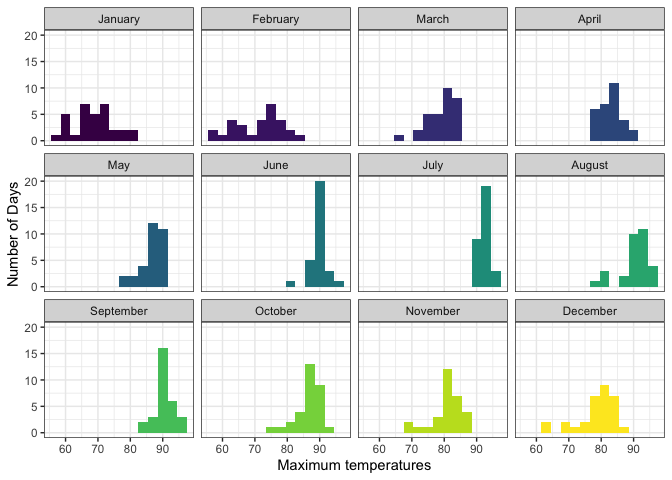
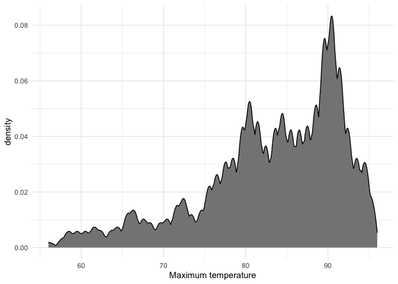
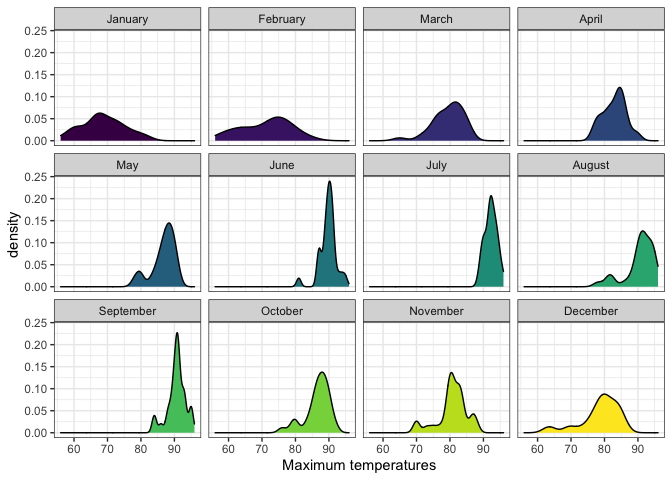
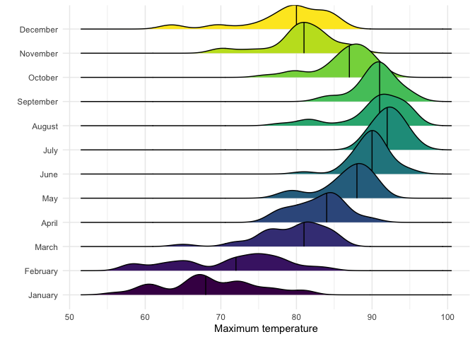
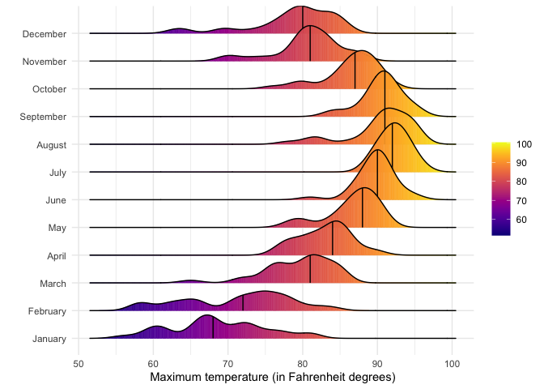

# Data Visualization Project 03


In this exercise you will explore methods to visualize text data and practice how to recreate charts that show the distributions of a continuous variable. 


## Part 1: Density Plots

Using the dataset obtained from FSU's [Florida Climate Center](https://climatecenter.fsu.edu/climate-data-access-tools/downloadable-data), for a station at Tampa International Airport (TPA) from 2016 to 2017, attempt to recreate the charts shown below


```r
library(tidyverse)
library(viridis)
weather_tpa <- read_csv("https://github.com/reisanar/datasets/raw/master/tpa_weather_16_17.csv")
# random sample 
sample_n(weather_tpa, 4)
```

```
## # A tibble: 4 × 6
##    year month   day precipitation max_temp min_temp
##   <dbl> <dbl> <dbl>         <dbl>    <dbl>    <dbl>
## 1  2016     6     8          0.25       89       78
## 2  2016     8    31          4.04       78       75
## 3  2016     5    21          0          86       72
## 4  2016     9    16          0          90       78
```

See https://www.reisanar.com/slides/relationships-models#10 for a reminder on how to use this dataset with the `lubridate` package for dates and times.


```r
weather_tpa$month_name <- factor(weather_tpa$month, levels = c(1:12), 
                  labels = c("January", "February", "March", "April", "May", "June", "July", "August", "September", "October", "November", "December"))
```


(a) Recreate the plot below:


Hint: the option `binwidth = 3` was used with the `geom_histogram()` function.


```r
weather_tpa %>% 
  ggplot(mapping = aes(x = max_temp, fill = month), color = "white") +
  geom_histogram(binwidth = 3, show.legend = FALSE) +
  facet_wrap(facets = vars(month_name), nrow = 3, ncol = 4) +
  theme_bw() + 
  labs(
    x = "Maximum temperatures",
    y = "Number of Days"
  ) +
  scale_color_viridis() +
  scale_fill_viridis()
```

<!-- -->


(b) Recreate the plot below:


Hint: check the `kernel` parameter of the `geom_density()` function, and use `bw = 0.5`.


```r
weather_tpa %>% 
  ggplot(mapping = aes(x = max_temp), fill = "grey") +
  geom_density(kernel = "epanechnikov", bw = 0.5, fill= "grey52") +
  theme_minimal() + 
  labs(
    x = "Maximum temperature"
  )
```

<!-- -->


(c) Recreate the chart below:


```r
weather_tpa %>% 
  ggplot(mapping = aes(x = max_temp, fill = month), color = "white") +
  geom_density(show.legend = FALSE) +
  facet_wrap(facets = vars(month_name), nrow = 3, ncol = 4) +
  theme_bw() + 
  labs(
    x = "Maximum temperatures"
  ) +
  scale_color_viridis() +
  scale_fill_viridis()
```

<!-- -->

Hint: default options for `geom_density()` were used. 

(d) Recreate the chart below:


Hint: default options for `geom_density()` were used. 


```r
library(ggridges)
weather_tpa %>% 
  ggplot(mapping = aes(x = max_temp, y = month_name, fill = month)) +
  geom_density_ridges(show.legend = FALSE, quantile_lines = TRUE, quantiles = c(0.5)) +
  theme_minimal() +
  labs(
    x = "Maximum temperature",
    y = ""
  ) +
  scale_color_viridis() +
  scale_fill_viridis()
```

```
## Picking joint bandwidth of 1.49
```

<!-- -->

(e) Recreate the plot below:


Hint: use the`ggridges` package, and the `geom_density_ridges()` function paying close attention to the `quantile_lines` and `quantiles` parameters.

```r
weather_tpa %>% 
  ggplot(mapping = aes(x = max_temp, y = month_name, fill = month)) +
  geom_density_ridges(show.legend = FALSE, quantile_lines = TRUE, quantiles = c(0.5)) +
  theme_minimal() +
  labs(
    x = "Maximum temperature",
    y = ""
  ) +
  scale_color_viridis() +
  scale_fill_viridis()
```

```
## Picking joint bandwidth of 1.49
```

<!-- -->
I think this is the same plot twice??

(f) Recreate the chart below:


Hint: this uses the `plasma` option (color scale) for the _viridis_ palette.


```r
weather_tpa %>% 
  ggplot(mapping = aes(x = max_temp, y = month_name, fill = stat(x))) +
  geom_density_ridges_gradient(quantile_lines = TRUE, quantiles = c(0.5)) +
  theme_minimal() +
  labs(
    x = "Maximum temperature (in Fahrenheit degrees)",
    y = "",
    fill = ""
  ) +
  scale_fill_viridis(discrete = FALSE, option = "C")
```

```
## Picking joint bandwidth of 1.49
```

<!-- -->


## Part 2: Visualizing Text Data

Review the set of slides (and additional resources linked in it) for visualizing text data: https://www.reisanar.com/slides/text-viz#1

Choose any dataset with text data, and create at least one visualization with it. For example, you can create a frequency count of most used bigrams, a sentiment analysis of the text data, a network visualization of terms commonly used together, and/or a visualization of a topic modeling approach to the problem of identifying words/documents associated to different topics in the text data you decide to use. 

Make sure to include a copy of the dataset in the `data/` folder, and reference your sources if different from the ones listed below:

- [Billboard Top 100 Lyrics](https://github.com/reisanar/datasets/blob/master/BB_top100_2015.csv)

- [RateMyProfessors comments](https://github.com/reisanar/datasets/blob/master/rmp_wit_comments.csv)

- [FL Poly News 2020](https://github.com/reisanar/datasets/blob/master/poly_news_FL20.csv)

- [FL Poly News 2019](https://github.com/reisanar/datasets/blob/master/poly_news_FL19.csv)

(to get the "raw" data from any of the links listed above, simply click on the `raw` button of the GitHub page and copy the URL to be able to read it in your computer using the `read_csv()` function)
